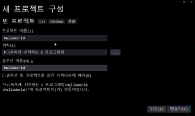
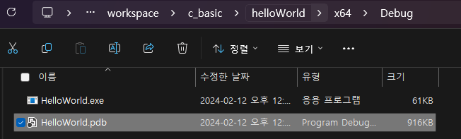

# I. Hello World
## A. 프로젝트 생성해보기
### 1. 프로젝트 생성


### 2. 프로젝트에 c 파일 생성
- 단축키: ctrl+shift+a
- 확장자 주의하기
	- .cpp -> C++로 컴파일
	- .c -> C로 컴파일

### 3. 코딩
```C
#include <stdio.h>
// returnType functionName(parameterType){code}
int main(void) 
{//실행 코드 블럭
	printf("Hello, World\n");//문자열 콘솔 출력
	return 0;//반환값
}
```
- stdio : study, studio아님
	- standard input output의 약자

### 4. 빌드 실행
- 컴파일 동작 후 링크 처리 
- 콘솔 출력 확인

```dockerfile
오후 12:40에 빌드를 시작함...
1>------ 빌드 시작: 프로젝트: HelloWorld, 구성: Debug x64 ------
1>HelloWorld.c
1>HelloWorld.vcxproj -> D:\developerFiles\workspace\c_basic\helloWorld\x64\Debug\HelloWorld.exe
========== 빌드: 1개 성공, 0개 실패, 0개 최신 상태, 0개 건너뜀 ==========
========== 빌드이(가) 오후 12:40에 완료되었으며, 01.469 초이(가) 걸림 ==========
```

### 5. 솔루션 내에 다른 프로젝트를 추가할 경우
파일 > 추가 > 프로젝트 추가 > 항목 추가 > .c > 코딩 후 빌드 > 디버그

## B. 프로그래밍 주의사항
### 1. -time
|시점|내용|주 에러 사유
|------|------|---|
|compile time|- .c 소스코드를 목적파일 .obj로 번역<br/>- JVM으로 치면 .java를 .class로 번역<br/>- 번역과정에서 컴파일러가 문법을 검사하고 에러가 없으면 번역을 완료함|문법상 에러|
|link time|- 목적 파일들과 라이브러리를 실행 파일로 합성<br/>- JVM 컴파일러 이후의 과정<br/>- 번역이 부품을 체크하는 과정이라면 링크는 그 부품을 조립|포인터 에러 등  > 조립 실패|
|build time|compileTime + LinkTime||
|run time|- 사용자 실행 시점|가장 중대한 에러(사용자 환경, 시간 등 다양한 원인)|

### 2. 소스코드와 목적파일
|확장자 명|특징|비고|
|---|---|---|
|.c|C언어 소스코드 파일|Text|
|.obj|소스코드 파일을 컴파일한 목적파일|PE|
|.lib|외부 라이브러리 파일로 컴파일 완료상태(obj와 유사)|PE|
|.exe|.obj와 .lib를 합성한 실행파일|NPE|
* PE(Portable Executable): 결합되지 않은 상태라 옮기면서 실행시킬 수 있는 파일 포멧. 바이너리 코드로 번역된 상태 
* <-> NPE(None Portable Executable)

## C. Visual Studio 
- 솔루션: 
	- 확장명: .sln
	- 여러 프로젝트를 묶어서 제공하는 서비스 단위 
	- F7키로 실행. 시작프로젝트 빌드
- 프로젝트: 
	- 어떤 솔루션 중 한 긴묶인 코드 집합 
	- 시작프로젝트로 지정해야 솔루션 빌드시 진행됨
	- 여러 프로젝트 중 실행하고 싶은 프로젝트를 시작프로젝트로 지정하고 실행해야 테스트할 수 있음
- VS는 여러 프로젝트를 한 솔루션으로 관리할 수 있음
	- 에디터, 컴파일러, 링커 등 프로그래밍에 편리
- x64를 주로 함. 32비트인경우 x82사용

- 프로젝트 구성
	- .exe : 실행파일
	- .pdb : 실행을 위한 db 파일
	- .c   : 소스파일
	- .vcxproj/vcxproj.filters: 프로젝트 환경 설정
- .vs, x64폴더는 vs가 직접 생성하므로 삭제해도 됨
- .c파일만 공유받을 경우 프로젝트를 새로 생성해야하므로 sln파일을 함께 보내는 것이 좋음
