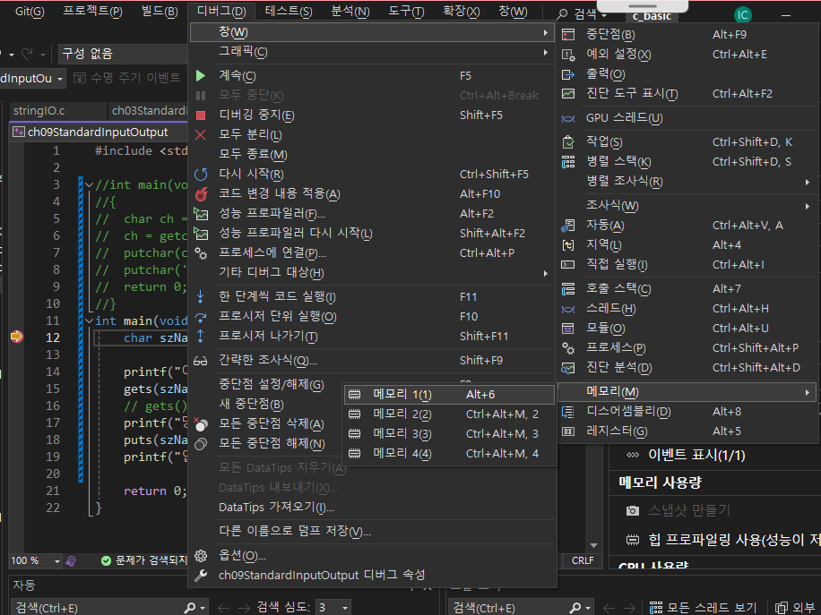

# I. 사용 가능한 문자와 예약어
## A. 사용 가능한 문자
- 여기서 문자란 소스 코드
- ASCII 코드 기준 문자 중 일부
	- a~z, A~Z, 0~9
	- white space(공백문자): 
	   space(1칸), tab(4칸), enter(라인 변경)...
	- escape sequence(\가 포함됨): 
		\n처럼 기능을 처리
		"와 같은 기능 문자를 그대로 사용하고 싶을때 \"
- 한글은 ASCII Code에 속하지 않음. UTF-8과같은 유니코드 
- 주석문에서는 상용 가능
## B. 예약어
- C언어에서 문법이나 기능 등 특수한 목적으로 사용되는 단어들
- 제어문, 자료형 등에 사용

|auto|break|case|char|const|
|---|---|---|---|---|
|continue|default|do|double|else|
|enum|extern|float|for|goto|
|if|int|long|registeer|return|
|short|signed|sizeof|static|struct|
|switch|typedef|union|unsigned|void|
|volatile|while||||
|_Bool|_Complex|_Imagnary|Inline||

- 마지막 줄은 수업 범위를 넘어섬

# II. 변수 이름 작성 규칙
- 변수 명은 식별자, Identifier.
	- 영문 대/소문자, '_', 숫자		
	- 변수명의 첫 글자에 숫자는 사용 불가
	- 이름 중간에 공백문자 사용 불가: snake_case, camelCase
	- 예약어 사용 불가
	(여기부터는 권장사항)
	- 너무 긴 이름은 좀...
	- 의미를 알 수 없는 이름도 좀...
- 변수명은 협업하는 프로그래머만이 아닌 미래에 이 코드를 다시 볼 자신을 위해서라도 가독성을 높여준다
	- 메모리주소 232214보다 변수명 userAddr가 읽기 좋다

# III. 항, 식, 구문, 함수
- 실행가능한 코드 덩어리: 함수 
- 항이 모여 식, 식이 모여 구문, 구문이 모여 함수가 된다
- 문자로 항을 기술(피연산자, 변수, 상수 등)
	- 소괄호를 이용해 여러 항을 한 항으로 묶음
- 항과 연산자가 모여 식을 완성, 식에 대한 평가(연산)
- 식이 모여 구문을 완성하며 여러 구문을 중괄호로 묶을 수 있다. 구문의 끝은 ;을 사용
- 여러 줄의 구문을 연속으로 실행하는 것을 함수라한다
- 변수는 선언과 정의로 구성된다. 
	- 선언: 이름과 자료형을 지정
	- 정의(초기화): 변수명에 값, 참조주소, 연산식 등을 지정
```C
//변수
int dNum; //자료형 변수명 선언
dNum = 3+2; //변수 정의
int pNum = dNum++;//선언과 정의를 한번에 가능
//함수
//returnType	functionName(parameterList...)
	int			main		(void)
//{code block(function body)
//	return 반환값;
//}
	{
		printf("hi"+pNum);
		return 0;
	}
```
- 컴파일은 위에서 아래로 순차적으로 진행. 
```C
#include <stdio.h>

int main(void){//여러 구문을 묶음 => 함수
	int nData; // nData라는 이름의 변수를 integer로 선언한다(구문)
	nData = 10; // nData(피연산자)에 10(상수)을 대입(연산자)한다(구문)
}
```
- #include  : 전처리기. 컴파일을 하기 전에 진행하기때문에 대부분 소스코드 최상단에 있음
- stdio     : standard Input Output. 표준 입출력 함수 라이브러리
- *.h       : header 파일 확장자. 선언에 해당하는 코드들이 들어있는 파일
- *.c       : c언어 소스파일 확장자

# IV. 문자열
- Char[]
- "Hello,World" : 메모리 주소

|H|e|l|l|o|,|W|o|r|l|d|
|---|---|---|---|---|---|---|---|---|---|---|

# V. 주석문
- 주석: 프로그램 소스 코드에 메모를 남기는 문법
- 코드에는 포함되지 않음 = 컴파일되지 않음

|문법|내용|
|---|---|
|//|한 행 전체|
|/* 구간 */|구간 전체|
|Ctrl+k+c|주석 지정|
|Ctrl+k+u|주석 해제|

- 코드는 공용 문서, 주석은 그 설명서
- 가장 가독성이 좋은 코드는 주석 없이도 이해할 수 있는 코드.
- 하지만 보조 수단으로 주석이 있는 것이 더 좋음

# VI. 디버거
## A. 체크 지점 설정하기
- 체크하려는 곳에 F9로 break point 처리하기
- F7로 빌드 실행
- F5로 디버그모드 실행
- 디버그 > 창 > 메모리 > 1(메모리창 보기)

- 열 배열 수정가능(64bit -> 8bit)
- 주소에 &변수명 입력하면 원하는 메모리로 이동
- F10으로 함수 내부 처리 추적: 변경사항이 있는 열은 <b style="color:red">빨간색</b>으로 표시함
- 입력 중일때는 다른 행동을 할 수 없음: 디버기가 실행 중일 때에는 사용할 수 없습니다.
- shift + F5 > 디버깅 모드 종료(프로그램 종료)
## B. 빌드에서 멈추는 경우
- F7 디버그 모드로 실행
- 에러 알람에서 무시 누르고 진행 > 에러 발생 지점에서 멈춤
- 호출 스택 창에서 추적
## C. 테스트시 팁
- 변수명은 좀 더 직관적이고 짧고 쉽게: 
- 전체를 돌리기보다 테스트 코드를 사용
	- 입력을 받아 쓰기전에 상수대입(하드코딩)을 사용해 테스트  
- 지역변수를 선언하고 초기화하지 않으면 연산을 진행할 수 없다. 
	- 무시하고 진행하면 원하는 값을 얻을 수 없음
- 변수는 하나만 쓰도록하면 정리하기 좋음
- 굳이 변수가 필요한가 체크
- 단위가 바뀌는 경계 값들이 제대로 처리가 되는지 확인
