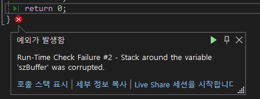

- computer
	- 주 연산 장치
		- CPU: 연산 담당
		- RAM: 연산할 재료
	- 주변 기기
		- HDD
		- 외부 저장장치
		- Input
			- 키보드
			- 마우스
			- 터치보드...
		- Output
			- 그래픽처리
			- 모니터
			- 스피커...
- Interrupt: 주변기기에서 발생한 신호. 이것이 컴퓨터의 주연산장치에 영향
- 이렇게 발생한 신호의 스케쥴 관리 등을 처리하는 것이 OS
- Input/Output: 데이터 입력
	- HCI(Human Computer Interface): 사람과 컴퓨터 사이의 데이터 교환을 처리하는 도구들
	- CLI(Command Line Interface): 키보드로 입력
	- GRI(Graphical User Interfase): 키보드, 마수으 등을 사용해 입력
- 입력된 데이터는 I/O Buffer(Memory)에서 <b>한 글자 단위</b>로 처리
	- RAM의 일부를 조금씩 분할에서 사용된다. 각 버퍼는 메모리 안에 임시 저장된 재료들.


# I. Console

	User mode : client 부분. 응용소프트웨어 대부분. 
		device file(실제 구동하는 프로그램을 추상화해 사용자가 사용하도록한 인터페이스)을 
		인터페이스로 사용
	________________________________
	Kernel mode: 입력된 정보를 임시로 저장했다가 연산장치로 전달
	- 장치 드라이버, OS 등
S/W: kernel+user mode 
___
H/W: CPU + RAM + 주변기기. 주변기기 > RAM > CPU > RAM > 주변기기...

- 콘솔: 사용자가 이용하기 쉽도록 만든 HCI 중 하나. 결론은 인터페이스

# II. char I/O
- getchar(), putchar: Buffered I/O, 값이 저장된 메모리의 값을 read나 write
	버퍼에 넣었다가 꺼냄
```c
	char ch = 0; //변수 선언, 정의
	//char도 문자를 의미하지만 정수 값을 지닌다. ASCII code 넘버
	ch = getchar();//getchar(): 사용자가 입력해놓은 I/OBuffer 중 한 글자를 가져오는 함수
	//I/OBuffer는 Queue. FILO 순차적 처리 처음에 들어온 것을 먼저 보냄
	putchar(ch);//putchar(char character): 매개변수에 적힌 문자를 IO 버퍼에 삽입
	putchar('Z');
	return 0;
```
키보드 입력 > 키보드 드라이버 데이터 전송 > 키보드 파일 인터페이스 > I/O buffer에 저장 > 콘솔 인터페이스에 표시 > getchar()가 그중 첫 입력을 꺼냄 > 변수 char ch에 대입(메모리) > putchar()가 ch에 저장된 값을 IO buffer에 삽입> 콘솔 인터페이스에 '사용자가 입력한 문자' 표시 > putchar()가 IO buffer에 'Z' 삽입 > 콘솔 인터페이스에 '사용자가 입력한 문자'Z가 표시됨

- _getch(), _getche(): Non-burffered I/O, 키보드 입력 자체에 대한 감지
	장치에서 바로 입력받음(중간 버퍼를 안거치고 바로 파일 인터페이스)
- 결과는 같지만 내부구조는 다름
```c
#include <conio.h>

int main(void) {
	char ch = 0;
	printf("아무 키나 누르면 다음으로 넘어갑니다. \n");

	ch = _getch();//IO Buffer 없이 바로 입력값 가져옴

	printf("입력한 키는 ");
	putchar(ch);//버퍼에 출력
	printf("입니다\n");
	return 0;
}
```
- 키보드 입력에서 문자를 체크할 경우에는 버퍼를 사용하는 함수를, 
	- 계속 진행하시려면 'y'를 ...
- "아무키나 누르시오"처럼 키 입력만 사용할 경우에는 None-buffer 함수 사용

# III. String I/O
- 문자열은 대부분 Bufferred I/O를 사용
- 문자열의 끝은 보통 null을 저장해 표시(String zero)
	- 예외도 있음
- 하나만 가져올때는 문자 함수를 
	- char 
- 여러 문자의 조합인 문자열은 문자열 함수를 사용
	- char[n] : 가변길이 배열... 중요
	- 배열은 연속해서 같은 자료형의 데이터가 입력됨
- 함수 종류
	- 입력
		- gets()   : 보안 이슈로 사용 x
		- gets_s() : 윈도우 계열 read(std Input)
		- fgets()  : 리눅스 계열 read(파일 인터페이스 사용)
	- 출력
		- puts()   : std Output
		- 
			- printf() :
			- scanf()  :
			- scanf_s():

- gets(), puts(): gets는 예제로만 보고 시큐어 코딩에 익숙해지자	
```c
// 배열의 선언과 정의
//	배열타입 배열이름[배열크기] = {배열 요소 초기값};
	char szName[32] = { 0 }; // 32칸을 모두 0으로 

	printf("이름을 입력하세요 : ");
	gets(szName);// gets(char *_Buffer)
	// gets()는 보안 결함 문제가 있음 gets_s(char *_buffer, size_t_Size) 권장

	printf("당신의 이름은 ");
	puts(szName); // 출력 후 자동 개행됨
	printf("입니다.");
```
- char * : character pointer - 문자가 저장된 메모리의 참조 주소

# IV. gets() 함수와 보안 결함(시큐어 코딩)
## A. gets() 함수의 보안 결함
- param으로 메모리 주소를 받음 
	- but 얼마나 써도 되는지 크기 확인이 안됨(가변길이를 받는 문자 배열. 메모리는 고정길이)
- 메모리의 경계를 벗어난 쓰기를 수행할 수 있음(보안이슈)
	- overflow: 경계를 벗어난 쓰기 
		- 이상 현상으로 이어짐 
		- 심각한 에러상황이 발생
		- 심지어 원격 쓰기가 일어나 정보 유출이 일어날 수 있음
		
- 보안 문제가 발생하지 않도록 코드 수준에서의 대응이 중요(시큐어 코딩 필요)
	- 행안부 간행물
		- [시큐어 코딩(C, Java)](https://www.mois.go.kr/frt/bbs/type001/commonSelectBoardArticle.do%3Bjsessionid=fr7QaTyG2gK5o02XJnYETp3havIQ1MGLKMYdWaaEe5me9IOk932SIy2BbP1AM08Z.mopwas54_servlet_engine1?bbsId=BBSMSTR_000000000012&nttId=42152) 
		- [소프트웨어 개발보안 가이드](https://www.mois.go.kr/frt/bbs/type001/commonSelectBoardArticle.do;jsessionid=TjAX2IwVk6hpONx8dKSZ4VTj.node10?bbsId=BBSMSTR_000000000015&nttId=88956)
## B. 시큐어 코딩 기초
- gets_s(char *_buffer, sizeof(대상 문자배열)): 윈도우
- fgets(char *_buffer): 리눅스
- 길이를 벗어나면 중단 시킴
```c
	char szBuffer[8] = { 0 };

//	gets(szBuffer);// 프로젝트 설정 > 구성 속성 > C/C++ > SDL 체크 false(보안검사x)
//  gets_s(char*_buffer, rsize_t_Size): 윈도우 기반
//		sizeof(배열) > 배열의 크기	
	gets_s(szBuffer,sizeof(szBuffer));
// fgets(char *_buffer, int *_maxCount, File *_Stream): 리눅스 기반
	fgets(szBuffer, sizeof(szBuffer), stdin);
	puts(szBuffer);

	return 0;
```
# V. 형식 문자와 이스케이프 시퀀스
# VI. 실수 출력
# VII. 문자, 정수 입력과 개행문자 제거
# IX. 형식 문자 기반 문자열 입력
[연습 코드](../c_basic/ch09StandardInputOutput)
# X. 실습문제