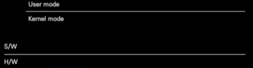

- computer
	- 주 연산 장치
		- CPU: 연산 담당
		- RAM: 연산할 재료
	- 주변 기기
		- HDD
		- 외부 저장장치
		- Input
			- 키보드
			- 마우스
			- 터치보드...
		- Output
			- 그래픽처리
			- 모니터
			- 스피커...
- Interrupt: 주변기기에서 발생한 신호. 이것이 컴퓨터의 주연산장치에 영향
- 이렇게 발생한 신호의 스케쥴 관리 등을 처리하는 것이 OS
- Input/Output: 데이터 입력
	- HCI(Human Computer Interface): 사람과 컴퓨터 사이의 데이터 교환을 처리하는 도구들
	- CLI(Command Line Interface): 키보드로 입력
	- GRI(Graphical User Interfase): 키보드, 마수으 등을 사용해 입력
- 입력된 데이터는 I/O Buffer(Memory)에서 <b>한 글자 단위</b>로 처리
	- RAM의 일부를 조금씩 분할에서 사용된다. 각 버퍼는 메모리 안에 임시 저장된 재료들.

# I. Console

	User mode : client 부분. 응용소프트웨어 대부분. 
		device file(실제 구동하는 프로그램을 추상화해 사용자가 사용하도록한 인터페이스)을 
		인터페이스로 사용
	________________________________
	Kernel mode: 입력된 정보를 임시로 저장했다가 연산장치로 전달
S/W: kernel+user mode
___
H/W: CPU + RAM + 주변기기. 주변기기 > RAM > CPU > RAM > 주변기기...

- 콘솔: 사용자가 이용하기 쉽도록 만든 HCI 중 하나. 결론은 인터페이스

# II. char I/O
# III. String I/O
# IV. gets() 함수와 봉안 결함(시큐어 코딩)
# V. 형식 문자와 이스케이프 시퀀스
# VI. 실수 출력
# VII. 문자, 정수 입력과 개행문자 제거
# IX. 형식 문자 기반 문자열 입력
# X. 실습문제