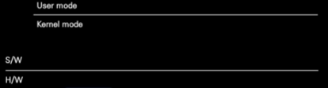

- computer
	- 주 연산 장치
		- CPU: 연산 담당
		- RAM: 연산할 재료
	- 주변 기기
		- HDD
		- 외부 저장장치
		- Input
			- 키보드
			- 마우스
			- 터치보드...
		- Output
			- 그래픽처리
			- 모니터
			- 스피커...
- Interrupt: 주변기기에서 발생한 신호. 이것이 컴퓨터의 주연산장치에 영향
- 이렇게 발생한 신호의 스케쥴 관리 등을 처리하는 것이 OS
- Input/Output: 데이터 입력
	- HCI(Human Computer Interface): 사람과 컴퓨터 사이의 데이터 교환을 처리하는 도구들
	- CLI(Command Line Interface): 키보드로 입력
	- GRI(Graphical User Interfase): 키보드, 마수으 등을 사용해 입력
- 입력된 데이터는 I/O Buffer(Memory)에서 <b>한 글자 단위</b>로 처리
	- RAM의 일부를 조금씩 분할에서 사용된다. 각 버퍼는 메모리 안에 임시 저장된 재료들.



# I. Console

	User mode : client 부분. 응용소프트웨어 대부분. 
		device file(실제 구동하는 프로그램을 추상화해 사용자가 사용하도록한 인터페이스)을 
		인터페이스로 사용
	________________________________
	Kernel mode: 입력된 정보를 임시로 저장했다가 연산장치로 전달
	- 장치 드라이버, OS 등
S/W: kernel+user mode 
___
H/W: CPU + RAM + 주변기기. 주변기기 > RAM > CPU > RAM > 주변기기...

- 콘솔: 사용자가 이용하기 쉽도록 만든 HCI 중 하나. 결론은 인터페이스

# II. char I/O
- getchar(), putchar: Buffered I/O, 값이 저장된 메모리의 값을 read나 write
	버퍼에 넣었다가 꺼냄
```c
	char ch = 0; //변수 선언, 정의
	//char도 문자를 의미하지만 정수 값을 지닌다. ASCII code 넘버
	ch = getchar();//getchar(): 사용자가 입력해놓은 I/OBuffer 중 한 글자를 가져오는 함수
	//I/OBuffer는 Queue. FILO 순차적 처리 처음에 들어온 것을 먼저 보냄
	putchar(ch);//putchar(char character): 매개변수에 적힌 문자를 IO 버퍼에 삽입
	putchar('Z');
	return 0;
```
키보드 입력 > 키보드 드라이버 데이터 전송 > 키보드 파일 인터페이스 > I/O buffer에 저장 > 콘솔 인터페이스에 표시 > getchar()가 그중 첫 입력을 꺼냄 > 변수 char ch에 대입(메모리) > putchar()가 ch에 저장된 값을 IO buffer에 삽입> 콘솔 인터페이스에 '사용자가 입력한 문자' 표시 > putchar()가 IO buffer에 'Z' 삽입 > 콘솔 인터페이스에 '사용자가 입력한 문자'Z가 표시됨

- _getch(), _getche(): Non-burffered I/O, 키보드 입력 자체에 대한 감지
	장치에서 바로 입력받음(중간 버퍼를 안거치고 바로 파일 인터페이스)
- 결과는 같지만 내부구조는 다름
```c
#include <conio.h>

int main(void) {
	char ch = 0;
	printf("아무 키나 누르면 다음으로 넘어갑니다. \n");

	ch = _getch();//IO Buffer 없이 바로 입력값 가져옴

	printf("입력한 키는 ");
	putchar(ch);//버퍼에 출력
	printf("입니다\n");
	return 0;
}
```
- 키보드 입력에서 문자를 체크할 경우에는 버퍼를 사용하는 함수를, 
	- 계속 진행하시려면 'y'를 ...
- "아무키나 누르시오"처럼 키 입력만 사용할 경우에는 None-buffer 함수 사용

# III. String I/O
- 문자열은 대부분 Bufferred I/O를 사용
- 문자열의 끝은 보통 null을 저장해 표시(String zero)
	- 예외도 있음
- 하나만 가져올때는 문자 함수를 
	- char 
- 여러 문자의 조합인 문자열은 문자열 함수를 사용
	- char[n] : 가변길이 배열... 중요
	- 배열은 연속해서 같은 자료형의 데이터가 입력됨
- 함수 종류
	- 입력
		- gets()   : 보안 이슈로 사용 x
		- gets_s() : 윈도우 계열 read(std Input)
		- fgets()  : 리눅스 계열 read(파일 인터페이스 사용)
	- 출력
		- puts()   : std Output
	- 기타 입출력: 이후에 따로 배움
		- printf() 
		- scanf()  
		- scanf_s()

- gets(), puts(): gets는 예제로만 보고 시큐어 코딩에 익숙해지자	
```c
// 배열의 선언과 정의
//	배열타입 배열이름[배열크기] = {배열 요소 초기값};
	char szName[32] = { 0 }; // 32칸을 모두 0으로 

	printf("이름을 입력하세요 : ");
	gets(szName);// gets(char *_Buffer)
	// gets()는 보안 결함 문제가 있음 gets_s(char *_buffer, size_t_Size) 권장

	printf("당신의 이름은 ");
	puts(szName); // 출력 후 자동 개행됨
	printf("입니다.");
```
- char * : character pointer - 문자가 저장된 메모리의 참조 주소

# IV. gets() 함수와 보안 결함(시큐어 코딩)
## A. gets() 함수의 보안 결함
- param으로 메모리 주소를 받음 
	- but 얼마나 써도 되는지 크기 확인이 안됨(가변길이를 받는 문자 배열. 메모리는 고정길이)
- 메모리의 경계를 벗어난 쓰기를 수행할 수 있음(보안이슈)
	- overflow: 경계를 벗어난 쓰기 
		- 이상 현상으로 이어짐 
		- 심각한 에러상황이 발생
		- 심지어 원격 쓰기가 일어나 정보 유출이 일어날 수 있음
		
- 보안 문제가 발생하지 않도록 코드 수준에서의 대응이 중요(시큐어 코딩 필요)
	- 행안부 간행물
		- [시큐어 코딩(C, Java)](https://www.mois.go.kr/frt/bbs/type001/commonSelectBoardArticle.do%3Bjsessionid=fr7QaTyG2gK5o02XJnYETp3havIQ1MGLKMYdWaaEe5me9IOk932SIy2BbP1AM08Z.mopwas54_servlet_engine1?bbsId=BBSMSTR_000000000012&nttId=42152) 
		- [소프트웨어 개발보안 가이드](https://www.mois.go.kr/frt/bbs/type001/commonSelectBoardArticle.do;jsessionid=TjAX2IwVk6hpONx8dKSZ4VTj.node10?bbsId=BBSMSTR_000000000015&nttId=88956)
## B. 시큐어 코딩 기초
- gets_s(char *_buffer, sizeof(대상 문자배열)): 윈도우
- fgets(char *_buffer): 리눅스
- 길이를 벗어나면 중단 시킴
```c
	char szBuffer[8] = { 0 };

//	gets(szBuffer);// 프로젝트 설정 > 구성 속성 > C/C++ > SDL 체크 false(보안검사x)
//  gets_s(char*_buffer, rsize_t_Size): 윈도우 기반
//		sizeof(배열) > 배열의 크기	
	gets_s(szBuffer,sizeof(szBuffer));
// fgets(char *_buffer, int *_maxCount, File *_Stream): 리눅스 기반
	fgets(szBuffer, sizeof(szBuffer), stdin);
	puts(szBuffer);

	return 0;
```
# V. 형식 문자와 이스케이프 시퀀스
## A. printf
- printf(params...) : print format. 
	- 양식에 맞춰서 정보를 조합해 출력
	- parameter: 매개변수의 수가 여러 

```c
	int x = 10;

// 문자 상수를 화면에 출력
	putchar('B');
// '\n'은 개행 문자이므로 알파벳 문자가 화면에 보이는 것은 아니다
	putchar('\n');
	printf("%c\n", 'A');
// '%d', '%c'는 형식 문자에 맞춰 변수 x에 담긴 정보를 출력한다
		// printf(format, variable)
	printf("x는 %d 입니다.", x);
```
## B. format character(형식 문자)
- 입력받을 값의 종류를 표시. 
- format을 사용하는 함수들에서 순차적으로 매핑해서 처리

|형식문자|자료형|표시|
|---|---|---|
|%c|int/char|character|
|%d|int|integer|
|%o|int|integer(8진수)|
|%x, %X|int|integer(16진수)|
|%f|double|float|
|%s|char[]|string|
|%u|Unsigned|unsigned integer|
|%e, %E|log|log10|
|%g|double|double|
|%zd|size_t|check size|
|%lld|long|long long integer(64비트)|
|%l64u|||

## C. escape sequence
- 백슬래시(\) 뒤에 한 문자나 숫자 조합이 오는 문자 조합
- 일부 외에는 거의 사용안됨. 외울 필요 없이 있다 정도만 기억하고 검색해 사용

|문자|의미|동작|
|---|---|---|
|\a|alert|경고음|
|\n|new line|새로운 줄에서 시작(개행)|
|\r|carriage return|커서를 행의 앞으로 이동(가끔 사용)|
|\b|backspace|키보드의 backspace 기능|
|\f|form feed|커서를 다음 페이지의 시작부분으로 넘김|
|\t|tab|키보드의 tab 기능|
|\v|vertical tab|수직으로 tab 기능|
|\o숫자|8진수|10진수와 구분하기 위해 사용|
|\x숫자|16진수|10진수, 문자열과 구분하기 위해 사용|
|\\|\ | \를 문자로 사용|
|\?|?|?를 문자로 사용|
|\'|'|'를 문자로 사용|
|\"|"|"를 문자로 사용|

```c
	printf("%d\n",1234); 
	printf("%d, %d\n", 1234, -5678);

	printf("%+d, %+d\n", 1234, -5678); // 부호 표시

	printf("%8d\n", 1234);  // 8칸 공백
	printf("%08d\n", 1234); // 8칸 공백을 0으로 표시
```

## D. 실수 출력
- 데이터가 차지하는 메모리 크기 비교 
unsigned_int sizeof(data); > data의 자료크기
	- float : 4 바이트
	- double: 8바이트
```c
//int로 형 변환
	printf("float size: %d\n", (int)sizeof(123.456F));
	printf("double size: %d\n", (int)sizeof(123.456));
```
float는 자료형의 크기가 작아 소수점 6자리부터 오차가 발생할 수 있음
```c
// float 형식을 실수 형식으로 출력
	printf("F: %f\n", 123.456F); // float
// double 형식을 실수 형식으로 출력
	printf("D: %f\n", 123.456); // double
	printf("LD: %lf\n", 123.456); // long double
	printf("G: %g\n", 123.456); // long double
```
콘솔창
```dockerfile
float size: 4
double size: 8
F: 123.456001
D: 123.456000
LD: 123.456000
G: 123.456
```
소수점 처리하기
```c
double dData = 123.456;
printf("%f, %f\n", dData, -123.456);
//소수점 2번째 자리에서 반올림해서 1자리까지 출력
printf("%.1f\n", dData);
//소수점 3번째 자리에서 반올림해서 2자리까지 출력
printf("%.2f\n", dData);
//소수점 4번째 자리에서 반올림해서 3자리까지 출력
printf("%.3f\n", dData);

printf("%8d\n", 123);
```
콘솔창
```dockerfile
123.5
123.46
123.456
     123
```
여러기능 한번에
```c
// 소수점을 포함해 12자리로 출력. 단 소수점 이하 4번째 자리에서 반올림하고 3자리까지 출력한다
printf("%12.3f\n", dData);
printf("%012.4f\n", dData);// 길이에 빈 자리를 0으로 표기
```
콘솔창
```dockerfile
     123.456
0000123.4560
```
# VI. 문자, 정수 입력과 개행문자 제거
## A. scanf(scanf_s)
- scanf()  : scan format
	- 양식에 맞춰서 정보를 조합해 입력
- scanf_s(): 보안 이슈로 이걸 사용
### 1. 왜 scan?
- 키보드를 눌렀을때 key Input이 일어나고 그 값을 scan code라고 했기때문에 그렇지 않을까(강사 추정)?
- 하드웨어에서 제조사마다 scan code 값이 다르다보니 규칙을 만듦 -> Virtual key code -> keycode(javascript event listener)
### 2. scanf로 문자 가져오기
입력의 끝은 개행문자(\n)

형식 문자	: %c
buffer		: 

|a|b|c|\n|||| 
|---|
> 이 중 처음 들어온(FIFO) 문자 사용 

형식 문자	: %c%*c
buffer		: 

|a|\n|1|2|3||||
|---|
> \* : 버퍼에 입력된 것 중 하나를 비운다

> %c로 처음 입력받은 a를 받고나면 \n이 남는다. 
이때 버퍼를 읽는 함수가 일을 하면 \n이 읽혀 이미 입력된 것으로 인식된다. 
이때 '%*형식문자'가 들어있으면 입력을 위한 \n을 저장하지않고 비우게된다.
여러가지를 입력받는 경우 이것을 꼭 넣어 버퍼를 비워줘야 제대로 작동함.

형식 문자	: %d\n
buffer		: 

|1|\n||||
|---|
> 값을 입력하고 enter를 치면 개행문자가 입력되는 것이 아닌 형식문자에 있는 \n을 읽은 것으로 간주한다. 
그렇기 때문에 다른 데이터가 입력되어야 read가 완료된다
```c
int i = 0;
scanf_s("%d\n",&i); //enter를 안먹음
printf("%d\n",i);
```

scanf_s(format, reffernce, size);
&variableName : 변수가 저장되어있는 메모리주소 
### 3. 사용해보기
- 한 글자 받기
```c
	char ch = 0;
	scanf_s("%c", &ch, 1);
//	scan_s(문자타입, ch가 저장된 참조주소, 읽을 메모리 수);
	printf("입력한 문자는 %c입니다.\n", ch);
```

- 여러 데이터 받기
	- '%*형식문자'를 사용해 버퍼에 입력된 \n 지우기
```c
	char name[32] = { 0 };
	int nAge = 0;

	printf("나이를 입력하세요 : ");
	scanf_s("%d%*c", &nAge);

	printf("이름을 입력하세요: ");
	gets_s(name, sizeof(name));

	printf("나이: %d세, 이름: %s", nAge, name);
```
- 두 정수 받기
	- 한번에 여러 수를 받는 경우 형식 문자 사이에 공백을 넣지 않는다. 
	- 물론 받을때마다 메세지와 스캔이 이뤄지는게 일반적이라 거의 쓰이지는 않는다. 
```c
	int x = 0, y = 0;

	printf("두 정수를 입력하세요");
	scanf_s("%d%d", &x, &y);

	printf("두 수의 합은 %d 입니다\n", x + y);
```

# VII. 형식 문자 기반 문자열 입력
배열은 그 자체가 참조 주소를 갖기때문에 &를 붙이지 않아도 된다. 
gets는 \n을 끝으로 보지만 scanf는 공백문자를 끝으로 본다. 
gets는 띄어쓰기가 되지만 scanf는 아님
- 여러 글자 받기
	- _countof(variable): 데이터 개수
	- sizeof(variable): 데이터 크기
	- 메모리를 추적해서 보면 이해에 도움이 된다. 
```c
	char szBuffer[4] = {0};
	scanf_s("%4c", szBuffer, (unsigned)_countof(szBuffer));
	printf("%c%c%c%c\n",szBuffer[0], szBuffer[1], szBuffer[2], szBuffer[3]);
```
- 그냥 s를 쓰면 문자열을 사용
```c
	char szBuffer[50] = {0};
	scanf_s("%s", szBuffer, (unsigned)_countof(szBuffer));
	printf("%s\n",szBuffer);
```
- sizeof를 사용
```c
	char text[20];
	int text_size = sizeof(text);
//  scanf_s(format, reference, dataSize);
	scanf_s("%s", text, text_size);
	printf("-> %s\n", text);
```

- 콘솔은 그저 연습용

[연습 코드](../c_basic/ch09StandardInputOutput)
# IX. 실습문제
```dockerfile
사용자로부터 이름과 나이를 키보드로 입력받아 출력하는 프로그램
이름은 gets_s, 나이는 scanf_s 함수로 입력받고
printf 함수로 출력
실행 예시
	나이를 입력하세요: 20
	이름을 입력하세요: 철수
	
	당신의 나이는 20살이고 이름은 '철수' 입니다.
```
[실습 코드](../c_basic/ch09StandardInputOutput/stdioQuestion.c)