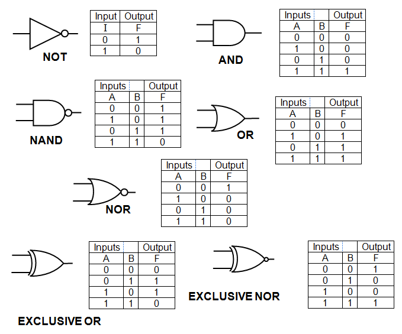
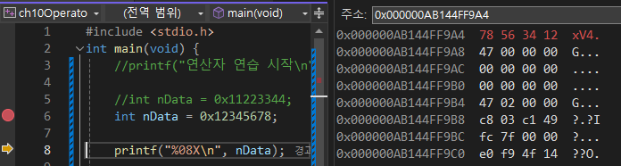

# I. 연산자 기본 이론
- 컴퓨터는 기본적으로 CPU와 RAM으로 구성된다
	- RAM은 연산에 필요한 데이터를 저장하고 전달하는 역할이고 
	- CPU는 ALU(산술논리장치)를 통해 연산을 진행한다. 
## A. 연산자
- 연산의 기본: + - * /
- CPU 연산과 직결되는 문법 
- 연산자 자체는 하나의 항 
- 여러 항을 모아 연산식을 작성(피연산자항 연산자항... = 연산식)
- 피 연산자 수에 따라 단항, 2항, 3항 연산자라 부름
	- &a; //단항 연산자
	- c=a+b; // 이항 연산자
	- d==1?1:0; // 삼항 연산자
## B. 연산자 종류
- 산술 연산자: +-*/%
- 대입 연산자: 좌측의 값을 복사해 우측에 입력(메모리 쓰기)
```c
int data; // 변수(메모리 위치) 선언
data = 10; // 좌측의 값(10)을 우측의 메모리 주소에 입력
```
- 형변환 연산자: 명시적 형변환때 사용. 대입받는 자료형의 표현 범위를 넘기는 경우 데이터의 소실이 발생할수 있다. 이런것을 알고도 진행하겠다는 개발자 동의의 개념. 
- 단항 증감연산자: 변수에 적용하는 연산자로 1씩 증감.
- 비트 연산자: 2진수로 만들어놓고 처리하는 연산자
- 관계, 논리, 조건 연산자
	- 관계 : 크기비교
	- 논리 : 조건연산자(and, or, not)
	- 조건 : 3항연산자
- sizeof: 메모리 크기를 확인하는 연산자
## C. <b style="color:red">연산자 우선순위(중요)</b>

|우선순위|연산자|종류|결합성|
|---|---|---|---|
|1|() [] . ->|괄호|L -> R|
|2|* & ! ~ ++ -- (type) sizeof|단항|<i style="color:blue">L <- R</i>|
|3|* % /|산술|L -> R|
|4|+ -|산술|L -> R|
|5|<< >>|비트|L -> R|
|6|< > <= >=|관계|L -> R|
|7|== !=|관계|L -> R|
|8|&|비트|L -> R|
|9|^|비트|L -> R|
|10|\|비트||L -> R|
|11|&&|논리|L -> R|
|12|\|\||논리|L -> R|
|13|?:|삼항|<i style="color:blue">L <- R</i>|
|14|= += *= /= %= &= \|= ^= <<= >>=|대입|<i style="color:blue">L <- R</i>|
|15|,|나열|L -> R|

- 항 자체에 개입 > 사칙연산 > 관계 > 논리 > 대입 > 나열
- 연산자 결합성 : 우선순위가 같은 경우 어떤 것을 먼저 연산할 것인지 나타내는 것
> 3+4+5 : 두 연산자 +는 우선순위가 같고 결합성이 L->R이므로 3+4 연산을 먼저 수행 
- 덧셈은 교환 법칙이 통하기때문에 큰 문제가 없으나 성립하지 않는 연산에서 문제가 생길 수 있음
> 이처럼 연속적으로 연산을 진행하는 경우 중간 결과값이 존재하는데 이를 '임시결과'라한다. 임시결과는 식의 결과가 완성될때 사라지는데 이 중간값을 사용하고 싶다면 변수를 넣어 식을 분리

# II. 산술 연산자
## A. 산술연산자 기초
- 대표적인 2항연산자
- + - * / %
- 연산자는 대부분 결과가 피연산자와 같게 나오지만 /와 %는 다를 수 있다. 
	- 정수/정수 -> 실수
	- 1/3과 1.0/3은 다른결과
		- 1/3 -> 0(int)
		- 1.0/3 -> 0.333(double)
	- 정수 간 나눗셈의 결과는 반드시 정수가 되며 소수점 이하는 절사
```c
	int x = 0;
	scanf_s("%d", &x); 
	printf("몫: %d \n", x / 3);// 정수/정수 > 정수
	printf("나머지: %d \n", x % 3);
```
- &(주소 연산자): write 권한이 있는 변수를 피연산자로 받음
- %(modulus operator): 나눈 후 나머지를 반환
- ,(나열 연산자) : 여러 대상을 나열할 때 사용

## B. 이형자료 연산과 형승격(Type promotion)
- 임시 결과는 피연산자 표현범위 이상의 표현이 가능해야 함
	- int : 42.9억 범위(부호포함 +-2x억) 
	- 이 범위를 벗어난 정수는 long long, long long int  사용
- 서로 다른 범위의 자료형이 산술연산에 사용될 경우 더 큰 범위로 형승격처리한다
	- char + int -> int
	- double * int -> double
- 출력하는 형식 문자와 변수, 결과값의 차이에 따라 다음 과 같은 다른 결과가 나타난다. 
```c
char ch = 'A';

printf("%c\n", ch);// character A는 65

printf("%c\n", ch+1); //character B 
printf("%d\n", ch+1); //66
printf("%c\n", 'A'+2); //A(65)+2 > charactor 67 -> C

printf("%d\n", 5.0+2); // int로 결과반환하면 절삭
printf("%f\n", 5.0+2); // 형승격
```
>콘솔 결과:
A
B
66
C
0
7.000000

## C. 0으로 나누면 안되는 이유
- 정수를 사용자 입력으로 받아 나누는 프로그램
```c
	int nInput = 0;
	printf("정수를 입력하세요: ");
	scanf_s("%d", &nInput);

	printf("10 / %d = %.3f \n", nInput, 10.0 / nInput);
```
- 심각한 결함: 0으로 나누기를 실행할 경우
```dockerfile
0x00F253F7에(ch10Operator.exe의) 처리되지 않은 예외가 있습니다. 
0xC0000094: Integer division by zero.
```
- 더 이상 연산을 진행하지 않고 프로그램을 멈춘다
- 나누기 == 연속된 뺄셈
- 사용자 입력은 절대로 신뢰해서는 안된다. 
	- 시큐어 코딩의 핵심은 여기서 시작한다. 
	- 무지한 사용자도 있지만 악의적인 사용자도 있음을 꼭 기억하자
## D. 산술연산 필수 실습
```dockerfile
문제1 
사용자로부터 두 정수를 입력받아 평균을 출력하는 예제. 
사용 함수: scanf_s, printf
평균값 출력시 반드시 소수점 둘째 자리까지만 표시
콘솔 예시
	두 정수를 입력하세요 : 10 20
	AVG: 15.00
```
[코드](../c_basic/ch10Operator/operator_01Question.c)
```dockerfile
문제2
사용자로	부터 정수로 초(second)를 입력받아 '시:분:초' 형식으로 출력
시, 분, 초 정보는 모두 두자리 정수로 표시하고 
한 자리 숫자의 경우 앞에 0을 붙여 출력
콘솔 예시
	초를 입력하세요: 4000
	4000초는 1시간 06분 40초 입니다. 
```
[코드](../c_basic/ch10Operator/operator_02Question.c)
# III. 대입 연산자
- 수학에서 =는 같다(관계연산자)라고 생각하지만 프로그래밍에서는 대입의 의미
	- ==가 같다(관계연산자)의 의미 
## A. 단순 대입 연산자
- 2항 연산자
- 단순 대입 연산자는 두 피연산자 중 오른쪽 피연산자(r-value)의 값을 왼쪽 피연산자(l-value)에 복사, 저장하는 연산자
```c
int r-value = l-value;
```
- 여기서 l-value는 left의 의미도 있지만 location의 의미도 있다
- l-value는 Overwrite가 발생하며 기존 값은 사라진다
	- l-value는 write 권한, r-value는 read 권한이 있어야한다 
	- 상수(불변 변수)는 l-value에 올 수 없다. r-value에는 사용가능 	
```c
	x = nInput;//대입연산
	//상수에 입력이 안됨
	3 = 4;
```
- 배열과 같이 메모리의 위치를 값으로 갖는 것을 '주소상수', '간접 참조 수준'이라 한다.
```c
	//배열은 '주소상수'로 변수가 아니다
	char szBuffer[32] = { 0 };
	//szBuffer = 3;
	szBuffer[0] = 3;
```
- l-value가 변수(local-value)가 아닐때 에러
> error C2106: '=': 왼쪽 피연산자는 l-value여야 합니다.

```dockerfile
두 변수의 값을 교환하는 코드를 작성
사용자로부터 두 정수를 입력받아 각각을 int형 변수 a, b에 저장하고
임시 변수 tmp를 활용해 a, b의 값을 교환한 후 출력하는 프로그램을 작성
출력 예시
	두 정수를 입력해주세요: 3 4
	a: 4, b: 3
```
[실습예제](../c_basic/ch10Operator/operator_03Question.c)
- 이처럼 임시값을 사용할때 마치 값의 이동이 신발끈모양처럼 좌하향하는 모습을 보고 '신발끈 공식'이라 한다

## B. 복합 대입 연산자
- 기능상 단순대입연산자와 산술연산자, 비트연산자가 조합된 연산자
	- 따로 쓰는 경우
	```c
	int data = 0;
	data = 10;//memory copy r -> l
	data = data + 5;// + 우선, 그 후 = 
		// 1. data의 값 + 5 => 임시결과 15
	//2. data의 location value에 임시결과 15가 overwrite
	```
	- 복합대입연산자
	```c
	data+=5;
	//1. data의 value를 받아 5를 합연산
	//2. 결과를 data의 loacation에 저장
	```
- 누적연산시 +=, -=, *=, /=, %=... 등 활용
	- 누산은 계수 처리 할때 정말 자주 사용함. 
	- 계수: 어떤 처리에대해 횟수를 체크
```dockerfile
사용자로부터 세 정수를 입력받아 총합을 출력
사용자 입력이 저장되는 변수 하나와 값을 누적하는 변수 하나만 사용해 구현
출력 예시 
	1
	2
	3
	total: 6
```
[실습예제](../c_basic/ch10Operator/operator_04Question.c)
# IV. 형변환 (단항) 연산자
- 피연산자의 자료형을 강제로 변경해주는 단항 연산자
- type 변환을 명시하는 연산자
- 더 넓은 범위로 유도하여 데이터 소실을 줄일 수 있다.
```c
	int x = 5;

	printf("%d\n", 5 / 2);				// int/int -> int
	printf("%f\n", 5.0 / 2);			// double/int -> double
	printf("%f\n", 5 / 2.0);			// int/double -> double
	printf("%f\n", (double)5 / 2);		// (double)int/int -> double
	printf("%f\n", (double)x / 2);		// (double)int/int -> double
	printf("%f\n", 5 / (double)2);		// int/(double)int -> double
	printf("%f\n", (double)(x / 2));	// (double)(int/int) -> double
```
- 부적절한 변환(더 좁은 범위의 타입 변수에 억지로 삽입하는 경우)시 정보가 유실될 수 있음
	- Pointer에서 자주 보게 됨
- 자유도는 높지만 그 책임은 개발자에게 있음
```c
	unsigned int data = 256; //32bit
	unsigned char ch; //8bit => 256

	ch = data;
	// 받을 수 있는 범위를 벗어나면 절사/overflow
	 
	printf("%d\n", ch);
```
# V. 단항 증/감 연산자
- 피연산자에 저장된 값을 1씩 증가/감소시키는 연산
- 피연산자는 반드시 쓰기가 가능한 l-value여야함
- 전위식, 후위식 표기가 가능하며 후위식인 경우 연산자 우선순위가 전체식을 평가(연산)한 후로 미뤄짐
```c
	int x = 0;
	printf("%d\n", x);
	// 따로
	x = x + 1;
	printf("%d\n", x);
	// 복합대입
	x += 1;
	printf("%d\n", x);
	//증감연산
	printf("%d\n", ++x);
	printf("%d\n", x++);
	++x; // 전위식 
	x++; // 후위식
```
> 콘솔
0
1
2
3
3
- 증감연산자만 쓰는 경우 전위와 후위의 차이가 없기때문에 주로 전위식을 쓴다
```c
x = 0; 
int nResult = 0;
	
++x;
printf("++x: %d\n", x);
x++;
printf("x++: %d\n", x);
nResult = ++x;
printf("++x: %d, res: %d\n", x, nResult);
nResult = x--;
printf("x--: %d, res: %d\n", x, nResult);
```
>console)
```dockerfile
++x: 1
x++: 2
++x: 3, res: 3
x--: 2, res: 3
```
- 이런 문제가 시험에 나오기도 하지만... 
```c
int a = 5, b = 10, data = 0;
data = ++a + ++b + a--;
//   =  a+1  + b+1 + a
printf("%d\n", data);
```
- 한 식에서 변수의 변경요인이 둘 이상인 것은 결코 좋은 코드가 아님
	- sequence point 정책 위반 
# VI. 비트 연산자와 Endian(엔디안)
## A. 비트연산자
- RC회로 수준의 논리회로를 high-level 언어 수준으로 풀이한 것

- 진수 변환 필수
- 자료를 비트단위로 논리식을 수행하는 연산
- 보통 2진수로 변환해 판단
- AND(&), OR(|), NOT(~), XOR(^), Shift left(<<), Shift right(>>)
- NOT은 단항, 나머지는 모두 2항 연산자

## B. 비트 마스크 연산
- 데이터에서 특정 영역의 값이 모두 0이되도록 지우는 연산
- AND의 특징을 이용(항등식과 유사): 
	- 0 AND n -> 0
	- 1 AND n -> n

```c
	int nData = 0x11223344;

	printf("%d\n", nData);

	printf("%08X\n", nData & 0x00FFFF00); // AND
	printf("%08X\n", nData | 0x00FFFF00); // OR
	printf("%08X\n", nData ^ 0x00FFFF00); // XOR
	printf("%08X\n", ~nData); // NOT

	printf("%08X\n", nData >> 8); // Shift right
	printf("%08X\n", nData << 8); // Shift left
```
> console
287454020
00223300
11FFFF44
11DDCC44
EEDDCCBB
00112233
22334400

8진수 > 2진수 변환 > 연산 
- 2항연산
	- Ox3344 AND 0xFF00

|8421|8421|8421|8421|
|---|---|---|---|
|0011|0011|0100|0100|
|And|
|1111|1111|0000|0000|
|binary result|
|0011|0011|0000|0000|

octal result = 3300

- 단항연산(NOT)
	- ~0x1234

|8421|8421|8421|8421|
|---|---|---|---|
|0001|0010|0011|0100|
|not|
|1110|1101|1100|1011|
|demical|
|14|13|12|11|

res = EDCB

- Shift 연산
	- Ox11223344 >> 8
	
|Ox11223344 >> 8 |
|---|
|0x00112233|

- shift 방향으로 zero padding이 이뤄짐. 

## C. 엔디안(Endian)
- 분명.. 0x12345678로 입력했는데 메모리에는 역으로 저장됨



- 메모리는 1byte 크기의 주소값으로 데이터를 관리
- int는 32bit 크기로 0잘라서 사용

|3|4|5|6|
|---|---|---|---|
|78|56|34|12|

- 사람은 작은 쪽에서 큰쪽으로 이동하는 것을 자연스럽게 보지만 그렇지 않을 수 있다

|&|data|
|---|---|
|3|78|
|4|56|
|5|34|
|6|12|

- 메모리의 데이터를 읽는 방식을 <b style="color:blue">Endian</b>이라 한다 
	- 메모리 주소를 큰 것에서 작은 번호로 읽는 것을 Little Edian
	- 메모리 주소를 작은 것에서 큰 번호로 읽는 것을 Big Edian
- 에디안은 CPU 프로세서 수준에서 관리
	- 인텔의 default 정책은 Little Edian
- 이건....어쩔 수가 없다

## D. 필수 실습 문제
```docker
사용자로부터 두 정수를 입력받아 뺄셈을 수행하고 그 결과를 출력하는 프로그램
단, 절대로 산술연산자 -를 사용하지 않고 비트 연산자를 이용해 구현

tip: 1의 보수 + 1 -> 2의 보수(차)
```
[실습](../c_basic/ch10Operator/operator_05Question.c)

- tip 홀짝 
	- 홀짝을 체크할때 나머지 연산자를 쓰는 방법과 비트연산자를 쓰는 방법이 있다. 
	- 둘 다 큰 문제는 아니지만 조금이라도 효율을 체크 할때는 bitwise 연산이 좀 더 좋다.
```c
	//bitwise operator
	nData & 0x00000001;
	//modulus operator
	nData % 1;
```
# VII. sizeof 연산자
- 메모리에 직접 접근하기때문에 데이터의 크기를 아는 것이 중요
- sizeof(var): 피연산자의 자료형에 대해 수행하는 <b style="color:blue">컴파일 타입 연산자</b>
- 컴파일 타임 연산자는 <b style="color:blue">런 타임 에러를 방지</b>할 수 있으므로 유용하다 
- 컴파일 타임 연산자는 <b style="color:blue">런타임때 수행되지 않기</b>때문에 메모리를 소비하지 않는다
- sizeof(5)와 sizeof(int)는 결과가 같음
- 배열에 대해서도 적용 가능
- 언어 수준에서 피연산자의 메모리 크기를 체크해 안정성을 확보할 수 있으므로 <b style="color:blue">최대한 자주 사용</b>할 것
```c
	int intVar = 5;
	int ointVar = 0x1234567;
	char charVar = 'A';
	float floatVar = 123.45F;
	double doubleVar = 123.45;

	printf("%d: %d, 0x%08x: %d, int: %d\n",intVar,sizeof(intVar),ointVar, sizeof(ointVar), sizeof(int));
	printf("%c: %d, char: %d\n",charVar,sizeof(charVar),sizeof(char));
	printf("%fF: %d, %f: %d\n",floatVar,sizeof(floatVar),doubleVar,sizeof(doubleVar));

	printf("+10: %d, ++: %d\n", sizeof(ointVar + 10),sizeof(++ointVar));
	printf("%d\n",sizeof(ointVar));

	int aList[16];
	printf("%d\n", sizeof(aList));
	printf("%d\n", _countof(aList));

	printf("%lld\n", sizeof(aList));
	printf("%lld\n", _countof(aList));
```
> console
5: 4, 0x01234567: 4, int: 4
A: 1, char: 1
123.449997: 4, 123.450000: 8
+10: 4, ++: 4
4
32
64
2269542323585088
2269542323585040
- 자료형의 크기(메모리에서 확보한 크기) 내에서 값의 변화는 의미없음

# IX. 관계연산자
- <, >, <=, >=
- 두 피연산자의 값을 비교(뺄셈)해 결과 도출
	- java의 comparator와 유사
- 상등, 부등, 관계 연산자로 분류
- 상등(==), 부등(!=) 연산은 좌항에서 우항을 뺀 결과를 비교하는 관계연산
- <b style="color:red">실수형에 대해 상등, 부등 연산은 불가</b>
	- 비교는 어떻게 하더라도 상등 부등은 해서는 안된다
	- 실수는 부동소수점을 사용하기때문에 오차가 존재하고 이로인한 심각한 보안 이슈를 발생시킬 수 있다.
```c
	int x = 5, y = 10;
	printf("x == y : %d\n", x == y);
	printf("x != y : %d\n", x != y);
	printf("x > 5  : %d\n", x > 5);
	printf("y < 5  : %d\n", y < 5);
	printf("y >= 10  : %d\n", y >= 10);

	printf("y <= x + 5 : %d\n", y <= x + 5);
```
>console)
```dockerfile
x == y : 0
x != y : 1
x > 5  : 0
y < 5  : 0
y >= 10  : 1
y <= x + 5 : 1
```
- 각 변 연산 > 비교
```c
printf("299.99999F: %d\n", 300 == 299.99999F);
printf("299.99999: %d\n", 300 == 299.99999);
printf("299.9999F: %d\n", 300 == 299.9999F);
printf("300.00001F: %d\n", 300 == 300.00001F);
```
>console)
```dockerfile
299.99999F: 1
299.99999: 0
299.9999F: 0
300.00001F: 1
```

# X. 논리 연산자
## A. 논리연산자 기본
- AND(&&), OR(||), NOT(!): 비트연산자와 유사하므로 주의 
	- AND: (   ) && (   )
	- OR: (   ) || (   )
	- NOT: !(   )
- 항 혹은 연산식을 피연산자로 두는 논리합(OR), 논리곱(AND) 2항 연산자
	- 여러 조건을 동시에 처리
- 논리 부정 연산자(NOT)는 단항 연산자
- 값의 범위 표현시 사용되는 것이 보통 
- 0은 거짓이고 0이 아닌 모든 값은 참
	- 음수도 true
```c
	scanf_s("%d", &nInput);
	bResult = nInput < 4 || nInput >= 60;
```

## B. 쇼트 서킷(Short circuit) 
- Short circuit은 효율을 높이기위한 것. 다른 프로그래밍 언어에서도 적용됨
- 굳이 하지 않아도 되는(결과가 이미 정해진) 연산식을 패스
- 결합성이 L -> R이므로 왼쪽의 연산식을 우선 평가하고 이어지는 연산식을 수행할 것인지 판단
	- OR 연산에서 L이 true면 R연산식을 평가할 필요가 없음
	- AND 연산에서 L이 false면 R연산식을 평가할 필요가 없음
	- A && B || C || D && E && F 
		- 왼쪽부터 연산자를 기준으로 항 3개를 묶음
		- 연산 후 위의 조건이되면 그 이후 연산은 전혀 안함을 기억
			- A && B || C가 true면 D부터는 굳이 연산 x
			- A && B || C || D가 false면 E부터는 굳이 연산하지 않음
- 처리 효율을 위해 가능한 간단한 연산을 좌측에 배치한다

## C. 범위 검사 흔한 오류 예
- 너무 익숙하게 쓰는 방식이지만...
```c
	bResult = 3 < nInput < 20;
```
- boolean이 따로 없고 0과 1로 사용되기 때문에 컴파일처리는 되지만 원하는 결과는 나오지 않음. 
```c
	bResult = nInput > 3 && nInput < 20;
```

## D. 조건(3항) 연산자
- C언어 유일의 피연산자를 3개로 받는 연산자
- 조건식 ? 항A : 항B
- 논리적 오류를 피하려면 선택 대상 항(항A, 항B)은 괄호로 묶어 표기. 항이 값이 아닌 식인 경우 더 더욱
```c
	nSelect = nInput <= 10 ? 10 : 20;
```
- 조건을 따져 분기를 선택할 수 있음. 
- 프로그래밍의 진짜 시작인 제어문

## E.필수 실습
```dockerfile
사용자로부터 점수(0~100)를 입력받아 
80점 이상이면 '합격' 그렇지 않으면 '불합격'이라고 출력하는 프로그램을 작성.
반드시 3항 연산자를 사용
출력 예시
	점수를 입력하세요 : 80
	결과: 합격
```
[실습코드](../c_basic/ch10Operator/operator_06Question.c)


[연산자 전체 코드](../c_basic/ch10Operator)

# XI. 실습문제
```dockerfile
문제1 : 최댓값 서바이벌 
사용자로부터 입력 받은 정수 중 가장 큰 수를 출력하는 프로그램을 작성
제한사항
	정수는 부호가 있는 32비트 정수로 한정 
	scanf_s() 함수로 한번에 한 값만 입력
	내부적으로 초댓값을 계속 갱신하는 구조
출력 예시
	10
	20
	30
	MAX : 30
```
[실습코드](../c_basic/ch10Operator/operator_07Question.c)
```dockerfile
문제2: 최대값 토너먼트
사용자로부터 입력받은 정수 중 가장 큰 수를 출력하는 프로그램을 작성
제한사항 
	정수는 부호가 있는 32비트 정수로 한정
	scanf_s 함수는 한 번만 사용
	최대값은 printf() 함수로 출력
출력 예시
	10 20 30
	MAX : 30
```
[실습코드](../c_basic/ch10Operator/operator_08Question.c)