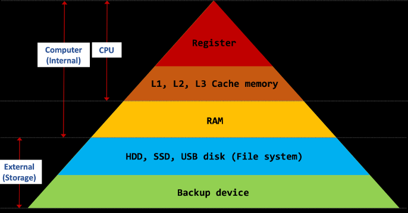
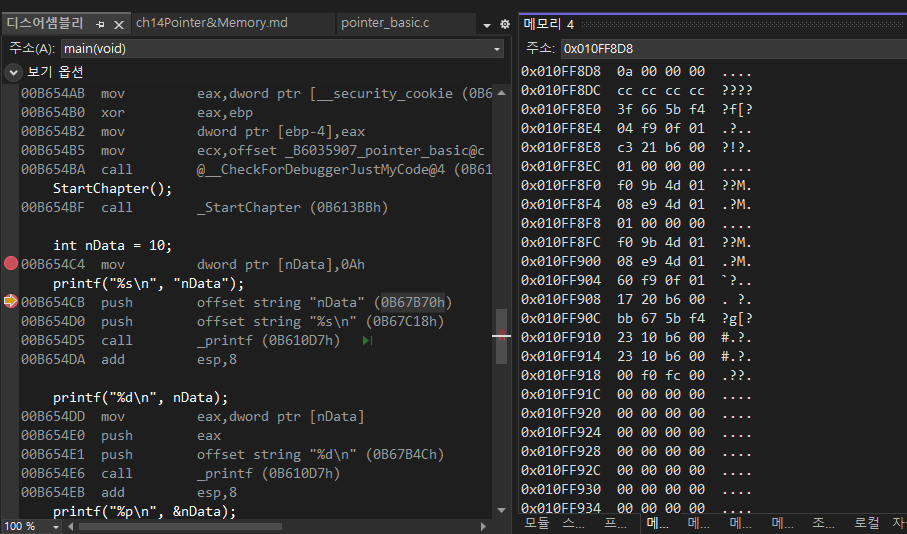
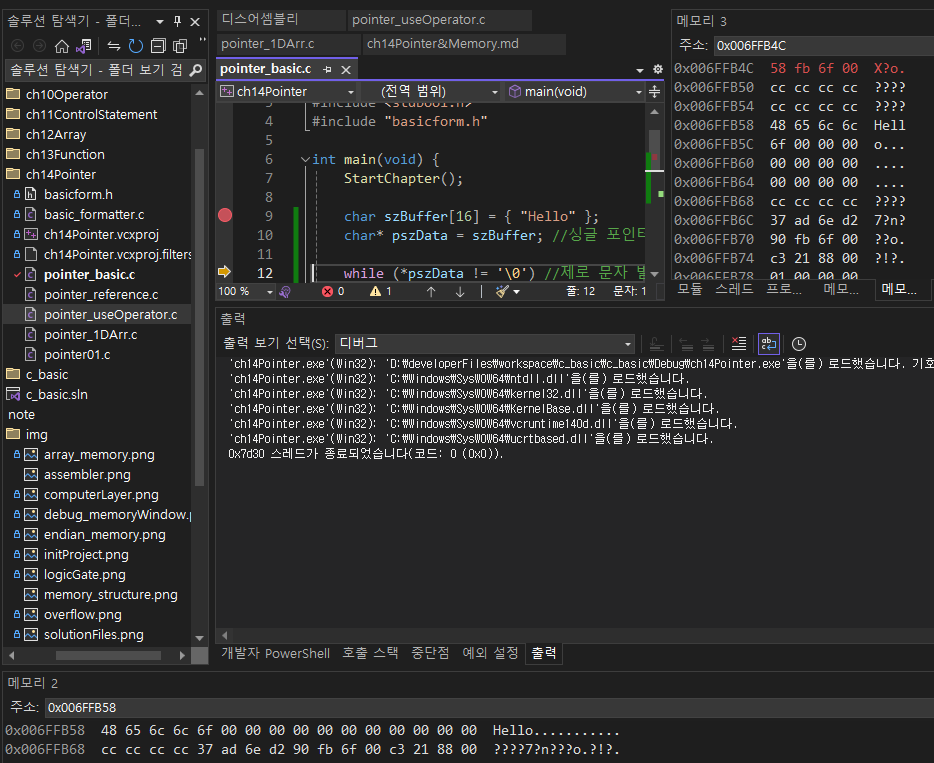
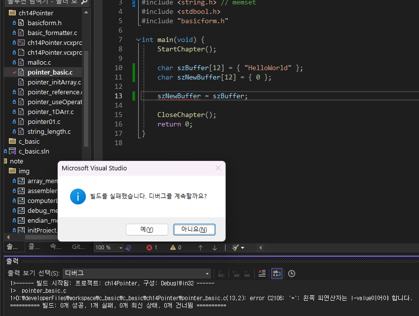
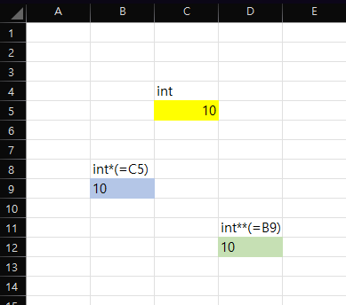
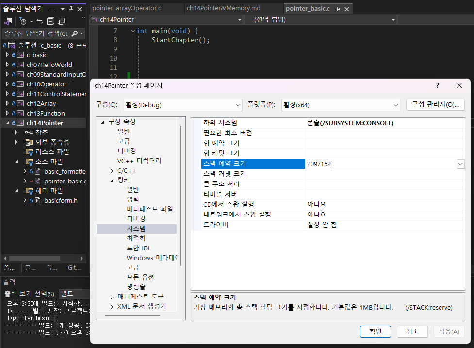

# I. 컴퓨터 메모리 종류
- CPU는 연산할 코드(함수/ 실행을 위한 기계어 집합)와 대상 정보(변수 또는 상수)를 모두 메모리로부터 가져옴
- 메모리는 변수를 통해 가져옴
- 모든 메모리는 고유한 주소를 가짐(바이트 단위/ 메모리상 위치 정보)
- 64bit 시스템에서 메모리 주소 길이는 64bit

## A. 하드웨어 기준 메모리 구조


|분류|명칭|설명|
|---|---|---|
|CPU|Register||
|CPU|L1, L2, L3 Cache memory||
|Internal (computer)|RAM|주로 다루는 영역|
|External (Storage)|HDD, SSD, USB disk (file system)|외부 저장 장치|
|External (Storage)|backup device||

- C언어의 특성상 프로세서를 직접 다루기도함
	- 범용 CPU가 아닌 기타 프로세서를 다루기도하다보니 범용으로 사용되는 문법과 동떨어진 경우도 있다
	- ex) ARM 모바일 프로세서, 라즈베리.. 등

## B. 소프트웨어(운영체제) 기준 메모리 종류
- 범용 컴퓨터(PC)는 가상메모리 시스템에서 관리되고 있는 메모리 종류
- Virtual = Logical > 소프트웨어다

|종류|특징|
|---|---|
|Stack|자동변수(scope), 보통 1MB|
|Heap|동적 할당 메모리(variable)|
|static(PE)|text(code) section: 실행 코드 기계어<br/>data section: <br/> &nbsp;- Read only(문자열 상수)<br/> &nbsp;- Read/Write(정적 메모리)|

## C. Windows vitual memeory system
- Process: 실행되는 프로그램
	- Thread: 프로세스 속에서 일을 처리하는 단위
		- main()의 수 
		- multi_thread: 쓰레드를 여러개 쓰는 프로그램
- OS : 프로세스를 돌릴 자원을 가상 메모리 공간에 알맞게 스케쥴링하는 역할(커널단계)
- VMS(virtual memeory space): OS를 통해 자원(RAM, HDD/SSD)을 얻어 프로세스를 수행하는 환경
	- 덩치가 큰 배열로 단순화해서 이해
	- logical space: 논리로만 존재하는 공간
- 메모리 
	- 자유도가 높지만 관리하지 않으면 OS가 프로그램을 실행 중지(프로세스를 죽였다)
	- 자바에서는 garbage collector를 사용해 참조 메모리를 관리
	- 엑셀과 유사하다

## D. 메모리 관리 함수
- 동적 = runtime에 작동
- malloc(), calloc() : 동적 메모리 할당 함수
- free() : 메모리 할당 해제 함수
- realloc()
- memset()
- calloc()
- memcpy() : copy
- memcmp() : compare
- memchr()

- 함수 소속

|#include|함수|
|---|---|
|<stdlib.h> | malloc()<br/>_countof()|
|<string.h> | memset()<br/>memcpy()<br/>memcmp()|
## E. 메모리 디버깅!!
- 이론을 이해하고 메모리 디버깅을 통해 파악하는 것이 중요

# II. 포인터 변수 기본 문법
- 포인터 변수: 메모리의 주소를 저장하기 위한 전용변수
- 64bit 시스템에서 주소 상수, 포인터 변수는 모두 64bit(8bytes)
- 1byte char형 변수의 메모리 주소(위치정보)는 64bit
	- char *pszData = &ch; // char ch = 'a';  
		- ch에대한 *포인터(주소)를 char 형식으로 쓰겠다(해석하겠다)
	- 매 메모리 공간마다 주소가 붙어있는 것이 아니라 관리하는 입장(OS)에서 코드를 붙인다는 것을 기억
```c
	printf("%d\n", nData); // 변수
	printf("%p\n", &nData); // 메모리 pointer
```
>console
10
0078F8EC
- 디버그 모드로 체크
	- F10으로 진행하다가 F9로 중단점을 지정하고 alt+8로 어셈블러를 체크

- 변수가 호출되는 메모리 주소는 프로세스가 실행될때마다 변경됨
	- Address Space Layout Randomization(ASLR): 메모리 손상 취약점 공격을 방지하기위한 기술. 스택, 힙, 라이브러ㅏ리 등의 주소를 랜덤한 영역에 배치해 target address 예측을 어렵게 만든다. 
	- stack, heap, library 등의 시작주소 관리 방식

## A. 직접 지정과 간접 지정
- 직접지정: 상수를 사용해 지정
	- 특정 메모리 공간을 int로 지정할때 상수로 지정 
int* pnData = D2;
- 간접지정: 변수를 사용해 지정
	- 포인터 변수로 지정하면 간접지정
*pnData;
- 간접지정은 변경될 수 있는 임의의 기준 주소로 상대적인 위치를 식별하는 방식
```c
int x = 10;
int* pnData = &x; 
printf("x: %d\n", x);
*pnData = 20; 
printf("x: %d\n", x);
```
- 엑셀을 사용하면 쉽게 사용할 수 있다

# III. 포인터와 1차원 배열
- 배열을 이루는 요소 형식에 대한 포인터 변수를 선언하는 것이 일반적
- 주소: 상수(식별자)
	- char []: char*
	- int []: int*
```c
char szData[5] = { 0 };
char* pszData = &szData;
```
- 간접 지정 연산 (*)의 결과는 형식이 있는 변수로 생각할 수 있음
	- *pszData = l-value; 
	- *(char*) ==> 
```c
int aList[5] = { 0 };
int* pnData = aList; // idx 0의 주소
//int *pnData = &aList[0];

printf("aList[0] : %d\n",aList[0]);
*pnData = 20;
printf("aList[0] : %d\n", aList[0]);// 같은 주소를 사용
printf("pnData[0] : %d\n", pnData[0]);
```
>console
aList[0] : 0
aList[0] : 20
pnData[0] : 20

- 포인터 변수나 배열 이름에 대해 +, - 연산을 할 수 있음(산술연산 아님)
- 산술 연산이 아닌 상대 위치(배열의 인덱스)를 계산하기 위한 연산이며 배열 요소의 개수
- 포인터 변수에 대해서는 단항 증/감 연산도 가능
- ++ / +를 주로 사용
	- 기준요소 index 0 을 식별자로 쓰고 나머지 요소는 상대적 위치로 
```c
*(aList + 1)
*(aList의 주소(idx 0) + 1) => idx 1의 주소
```
- 배열의 크기에 따라 주소하나를 옮겼을때 커지는 값의 크기가 달라진다
	- char[8] 
	- short[4] 
	- int[2]
- single pointer와 single demention array는 거의 같다
```c
char szBuffer[16] = { "Hello" };
char* pszData = szBuffer; //싱글 포인터

while (*pszData != '\0') //간접 지정. 제로 문자(null) 발견전까지 이동
	pszData++; // 더하기연산(산술 아님. 포인터 이동)
printf("&pszData: %p, &szBuffer: %p\n",
	pszData,
	szBuffer);// 메모리 주소
printf("Length: %d\n", pszData - szBuffer); // 빼기 연산(산술아님)
// > 문자열의 길이 계산 로직
```
>console
&pszData: 003AF8CD, &szBuffer: 003AF8C8
Length: 5


- 아래는 char szBuffer[]의 첫 요소(idx 0)에 저장된 데이터를 보관
- 우측은 char szBuffer[]의 주소값이 pszData에 litte endian 방식을 따라 저장되어있음을 관측 가능
- while문이 돌면서 pszData의 메모리 주소가 끝(little endian으로 제일 왼쪽의 값)이 변경됨을 관측 가능

- string의 길이를 측정하는 함수
```c
strlen(szBuffer);
```

# IV. 메모리 동적할당 및 해제
## A. 메모리 동적 할당
- 개발 시점(Build = Compile + Link)때 모든 사용량을 예측할 수 없다. 사용자의 입력이 발생하는 RunTime에 사용하도록 확정할 수 없는 양을 사용
- Heap 영역을 사용하는 방법
- 프로그램 실행 중 필요한 메모리를 OS에 요청(할당)해 사용하며 반환(해제)의 책임이 있음
	- OS가 허가한 양 이내에서 사용가능
	- 반환은 필수
- 할당받은 메모리는 쓰레기 값이 들어있음
	- 할당 받고 비우거나(clear) 덮어 씌우거나(overwrite) 데이터에 영향을 받지 않도록 코드를 짜야 한다.
	- 용량에 따라 결정
	- 중요한 것은 쓰레기 값을 인지해야함
- 쓰레기값: 디버그 중 일때
	- 지역변수: cc
	- 동적할당한 메모리: cd
	- 동적할당한 메모리 앞 뒤: fd
- malloc() : stdlib.h 소속
	- returnType: 메모리 주소
	- parameterType: 
- free()
 	- returnType: 
	- parameterType: 메모리 주소(식별자)
	- free를 사용하면 사용한 양 + OS 준비량이 한번에 초기화됨
```c
	int* pList = NULL;

	pList = (int*)malloc(sizeof(int) * 3);
	//int 3개 크기의 메모리 3개를 준비해라
	// 개발시점에는 모름. runtime에서 파악
	pList[0] = 10;
	pList[1] = 20;
	pList[2] = 30;

	for (int i = 0; i < 3; i++)
		printf("%d %d\n", i, pList[i]);
	free(pList);// 메모리 반환
```

## B. 할당 단위와 페이지
- 자원 배분을 위한 단위
	- Allocation = 64 KB // 음료수 트럭
	- 한 번에 이동하는 크기 = 4KB // 음료수 상자
- 단위(4KB)를 다 쓰지 않는 경우 다른 곳에 대여하거나
- 단위를 조금 넘는(3KB, 2KB) 경우 새로운 단위를 가져온다 => 2단위

```c
int* pList = NULL, i = 0;

pList = (int*)malloc(sizeof(int) * 3);
//int 3개 크기의 메모리 3개를 준비해라
// 개발시점에는 모름. runtime에서 파악
pList[0] = 10;
pList[1] = 20;
pList[2] = 30;

for (i = 0; i < 3; i++)
	printf("%d %d\n", i, pList[i]);
free(pList);// 메모리 반환
```

# V. 메모리 초기화, 복사, 비교
- 단순 변수를 사용할때와 달리 포인터를 사용하는 데이터들(배열 등)은 새로운 고민을 시작하게한다.
## A. 초기화
### 1. 메모리 사용 위치 비교
- 지역변수이자 자동변수(stack memory), char[6] 배열로 처리
```c
char szBuffer[] = { "Hello" };
```
- 포인터 변수: 정적(static area) 문자열 상수
	- in java: public static final char[] 
```c
char* pszBuffer = "Hello";
```
- 메모리 동적 할당/ 메모리 공간 최대 char[6]
	- heap memory
	- 시작은 null(\0)
```c
char* pszData = NULL;
pszData = (char*)malloc(sizeof(char) * 6);
pszData[0] = 'H';
pszData[1] = 'e';
pszData[2] = 'l';
pszData[3] = 'l';
pszData[4] = 'o';
pszData[5] = '\0';
```
- 셋 모두 메모리 주소(논리적 분류)가 다름
```c
puts(szBuffer);
puts(pszBuffer);
puts(pszData);
```
- 메모리 동적할당 해제
```c
free(pszData);
```
- 초기화와 관련된 여러 메서드
	- malloc(): 메모리 크기 OS에 요청
		(int*)malloc(sizeof(int) * 3);
	- memset(): 대상에 데이터를 크기만큼 초기화
		memset(pList, 0, sizeof(int) * 3);
	- calloc(): 메모리를 요청하면서 데이터를 크기만큼 초기화
		- malloc() + memset()
		(int*)calloc(3, sizeof(int));
```c
//pointer
int* pList = NULL, * pNewList = NULL;
//array
int aList[3] = { 0 }; // 12 bytes 이중 식별자는 index 0를 가리킴 

//메모리 초기화의 가장 일반적인 예
pList = (int*)malloc(sizeof(int) * 3); // 64bit짜리 메모리주소
memset(pList, 0, sizeof(int) * 3);  // 64bit짜리 메모리주소

//malloc + memset -> calloc: 동적할당 후 쓰레기 값을 0으로 초기화시킴
pNewList = (int*)calloc(3, sizeof(int));

for (int i = 0; i < 3; ++i)
	printf("pList[%d]의 값: %d\t", i, pList[i]);
putchar('\n');
for(int i = 0; i < 3; ++i )
	printf("pNewList[%d]의 값: %d\t", i, pNewList[i]);
putchar('\n');

free(pList);
free(pNewList);
```
- 동적할당을 했을때 쓰레기값을 무조건 0으로 초기화해야하는가?
	- no
	- 다만 동적할당으로 문자열을 사용할때는 가능한 초기화
## B. <b style="color:red">복사</b>(매우 중요)
- 단순 대입연산자의 두 피연산자가 모두 변수라면 메모리 값을 복사하는 것으로 생각할 수 있음
```c
// 변수의 복사는 당연
	aVar = bVar;
// l-value (대입) r-value;
```
- 하지만 변수의 좌측은 상수(메모리 주소값)
- 사고가 많이 발생...
```c
char szBuffer[12] = { "HelloWorld" };
char szNewBuffer[12] = { 0 };

szNewBuffer = szBuffer; 
```

- copy의 종류
	- Deep copy : 내부 데이터까지 복사
	- Shallow copy : 포인터만 복사
- 배열에 대해서는 단순 대입 연산으로 배열 전체를 복사할 수 없으며 반복문을 통해 개별 요소를 하나씩 복사(단순 대입)해야한다.
- memcpy()를 사용하자
```c
	//		붙여 넣을,	가져올,	크기
	memcpy(szNewBuffer, szBuffer, 4);
```
- memcpy의 내부는 이렇게 루프를 돌며 단순 대입
```c
char szBuffer[12] = { "HelloWorld" };
char* pszData = NULL;
pszData = (char*)malloc(sizeof(char) * 12);
for(int i = 0; i < 12; ++i)
	pszData[i] = szBuffer[i];
puts(pszData);
```

## C. 비교
- 비교는 뺄셈!
- java도 단순히 비교하지 않고 _string.equals(_string_other)
```c
	char szBuffer[12] = { "TestString" };
	char* pszData = "TestString";

	printf("%d\n", memcmp(szBuffer, pszData, 10));
	printf("%d\n", memcmp("teststring", pszData, 10));
	printf("%d\n", memcmp("DataString", pszData, 10));
```
>console
0
1
-1

## D. 실습 문제
```dockerfile
아래 코드의 결함에 대해 말하고 바르게 수정하시오
#include <stdio.h>
#include <stdlib.h>
int main(void) {
	char szBuffer[12] = { "HelloWorld" };
	char* pszData = NULL;
	pszData = (char*)malloc(sizeof(char) * 12);
	pszData = szBuffer;
	puts(pszData);

	return 0;
}
```
[실습 예제](../c_basic/ch14Pointer/pointer_01Question.c)
- compile time에서는 에러가 발견되지 않기때문에 주의가 필요하다
- 문자열 전용 복사 함수가 있다
  - strcpy() > 보안 이슈 > strcpy_s() 사용 권장

# VI. 배열 연산자 풀어쓰기
- 1차원 배열 연산자와 1차 싱글 포인터는 거의 기능이 일치
- 인덱스를 이용해 상대 위치를 계산
- *(기준 주소 + 인덱스) == 기준주소[인덱스]
	- &식별자 : 
	- *(주소) : 간접지정
```c
//예시 문자열
	char szBuffer[32] = { "You are a girl." };
```
- 모두 같은 대상을 지칭
```c
	//배열연산자
	printf("szBuffer[0]: %c\n", szBuffer[0]);
	//배열연산자를 풀어쓴 것 
	printf("*(szBuffer + 0): %c\n", *(szBuffer + 0));
	//index 0는 포인터가 지칭하는 것과 같음
	printf("*szBuffer: %c\n", *szBuffer);
```
- 인덱스 수와 같음
```c
	printf("szBuffer[5]: %c\n", szBuffer[5]);
	printf("*(szBuffer + 5): %c\n", *(szBuffer + 5));
```
- *szBuffer + 5 -> 'Y' + 5(메모리상 이동이 아닌 ASCII 문자 이동) > 오류
- 주소연산자(&)와 간접지정(*)은 정반대의 처리
	- arrayName[4] == *(arrayName + 4)
	```c
		printf("&szBuffer[4]: %s\n", &szBuffer[4]);
	```
	- &*가 함께 사용되면 항등식처럼 식별자가 그대로 나온다(상충)
	```c
		printf("&*(szBuffer + 4): %s\n", &*(szBuffer + 4));
	```
	- 문자열로 해석하면(%s) 문자열 중 null(\0)를 찾을때까지 이어진다
	- 만약 null이 발견되지 않으면 무한로딩
	```c
		printf("szBuffer + 4(str): %s\n", szBuffer + 4); // 주소

	```
	- 포인터로 해석하면(%p) 메모리 주소를 반환한다
	```c
		printf("szBuffer + 4(pointer): %p\n", szBuffer + 4);
	```
>console
szBuffer[0]: Y
*szBuffer: Y
*(szBuffer + 0): Y
szBuffer[5]: r
*(szBuffer + 5): r
*szBuffer + 5: ^
&szBuffer[4]: are a girl.
&*(szBuffer + 4): are a girl.
szBuffer + 4(str): are a girl.
szBuffer + 4(pointer): 00000020783BF80C

# VII. 문자열 복사, 비교, 검색(동적할당)
- 문자열이란 문자의 배열이다
- 배열은 당연히 포인터를 쓰게된다
## A. 문자열 복사
```c
	char szBuffer[] = "Hello";
	// szBuffer의 주소(16진수 64비트로 표시한 index 0의 위치)
	char* pszBuffer = szBuffer; 
	
	//메모리 동적 할당
	char* pszHeap = malloc(16);//16칸이 확보된 배열의 index 0의 메모리 주소
	strcpy_s(pszHeap, 16, pszBuffer);//deep copy: 메모리 주소가 아닌 원래 대상의 값 Hello를 복사
	//pszHeap = pszBuffer; 값이 넘어오는 것이 아닌 그저 메모리 주소를 가리킴

	puts(pszHeap);
	free(pszHeap);
```
## B. 문자열 비교
- 비교는 대상 - 비교대상
- memcmp와의 차이점
	- memcmp는 메모리의 사이즈를 매개변수로 받음
	-  strcmp는 문자열 길이를 따로 입력하지 않음
```c
	char szBuffer[12] = { "TestString" }; //stack memory
	char* pszData = "TestString";//static memory

	printf("%d\n", strcmp(szBuffer, pszData));
	printf("%d\n", strcmp("TestString", pszData));
	printf("%d\n", strcmp("Test", "TestString"));
```
>console
0
0
0
-1
- return 0 : 같다
```c
if(strcmp("Test", "TestString") == 0){
	// 같을때 구동할 구문
}
```
- 검색: 메모리주소 strstr(검색대상배열,검색어) 
	- 검색 결과가 없으면 00000000
```c
	char strBuffer[32] = { "I am a boy" };
```

|I| |a|m| |a| |b|o|y|\0|
|---|---|---|---|---|---|---|---|---|---|---|

```c
	printf("%p\n",strBuffer);//I가 보관된 메모리 주소
	printf("am: %p\n", strstr(strBuffer, "am"));//검색어 제일 앞인 a가 보관된 메모리 주소
	printf("boy: %p\n", strstr(strBuffer, "boy"));
	printf("zzz: %p\n", strstr(strBuffer, "zzz"));
	
	printf("index(am): %d\n", strstr(strBuffer, "am") - strBuffer);
	printf("index(boy): %d\n", strstr(strBuffer, "boy") - strBuffer);
```
>console
004EFA5C
am: 004EFA5E
boy: 004EFA63
zzz: 00000000
index(am): 2
index(boy): 7
# IX. 동적 할당된 메모리 구조와 realloc()
- 메모리를 관리하는 주체는 OS
	- 관리 단위(Allocation): 64KB
	- malloc() 단위: 4KB
	- free()를 사용해 해제하더라도 나눈 chunk는 유지됨
	- 조각 사이에서 사용할 수 없는 영역이 있으면 낭비됨
- 운영체제가 제공하는 단위(Chunk)를 그대로: malloc()
	- malloc과 free가 계속 이어지면 메모리 조각들이 남고 그것을 찾고 사용하는 과정에서 연산 시간을 더 소모하기도한다.  
- 메모리 할당 크기를 직접 조정: realloc()
## A. realloc()
- 기존에 할당받은 메모리의 크기를 조정해 다시 할당(주로 확장)
	- 받은 청크에 여유가 있으면 무리없이 확장 가능
- 메모리 청크 크기 조절에 실패할 경우 전혀 새로운 위치로 이동
```c
	char* pszBuffer = NULL, pszNewBuffer = NULL;
```
- 12바이트 요청
```c
	char* pszBuffer = NULL, * pszNewBuffer = NULL;
	
	pszBuffer = (char*)malloc(12);// 12바이트 요청
	sprintf_s(pszBuffer, 12, "%s", "TestString"); 

	printf("[%p] %zd %s\n", 
		pszBuffer, 
		_msize(pszBuffer), 
		pszBuffer
	);
```
- 32바이트 요청
	- 확장이 가능하면 메모리 주소 변경 x
	- 확장이 불가하면 메모리 이관 > 주소 변경
```c
	pszNewBuffer = (char*)realloc(pszBuffer, 32); 
	//32바이트로 확장 요청
	
	sprintf_s(pszNewBuffer, 32, "%s", "TestStringData");
	printf("[%p] %zd %s\n",
		pszNewBuffer,
		_msize(pszNewBuffer),
		pszNewBuffer
	);

	free(pszNewBuffer);
```
>console
[01659FB0] 12 TestString
[01659FB0] 32 TestStringData

- 게임 서버처럼 OS 관리를 직접 구현하는 경우가 아닌이상 realloc을 쓰는 경우가 거의 없다

# X. 다중포인터(개념만)
- 싱글 포인터가 익숙해진 뒤에 자세히 볼 것
- 포인터에 대한 포인터(간접 지정)
	- char*에 대해 *(char*) == char(자료형)
	- char**에 대해 *(char**) == char*
	- char\**\*에 대해 *(char***) == char**
	


```c
	char ch = 'A'; // 원본
	char* pData = &ch; // pointer
	char** ppData = &pData; // pointer to pointer
	char*** pppData = &ppData; // pointer to pointer to pointer

	printf("origin: %c[%p]\n", ch, &ch);
	printf("*: %c[%p]\n", *pData, &pData);
	printf("**: %c[%p]\n", **ppData, &ppData);
	printf("***: %c[%p]\n", ***pppData, &pppData);
```
>console
origin: A[0055FC6B]
*: A[0055FC5C]
**: A[0055FC50]
***: A[0055FC44]

- 2중 포인터도 쓴 적이 옛날이고 3중은 거의..
- 알면 좋지만 싱글 포인터에 대한 이해가 제대로 안됐을때는 굳이 볼필요 없음

- 다만 데이터 자체가 배열인 문자열에서는 이런식으로 사용함
```c
	// 문자열이 저장된 주소(포인터)들의 배열
	char* astrList[3] = { "Hello","World","String" };
```
- 포인터들의 배열정도는 써보자
```c
	printf("astrList[i]\n);
	printf("%s\n", astrList[0]);
	printf("%s\n", astrList[1]);
	printf("%s\n", astrList[2]);

	printf("astrList[i]+1\n);
	printf("%s\n", astrList[0] + 1);
	printf("%s\n", astrList[1] + 2);
	printf("%s\n", astrList[2] + 3);

	printf("astrList[i][j]\n");
	printf("%c\n", astrList[0][3]);
	printf("%c\n", astrList[1][3]);
	printf("%c\n", astrList[2][3]);
```
>console
astrList[i]
Hello
World
String
astrList[i]+1
ello
rld
ing
astrList[i][j]
l
l
i
# XI. 다차원 배열에 대한 포인터
- 2차원까지만 이해... 
- 2차원 배열은 1차원 배열을 요소로 갖는 1차원 배열로 이해
- char aStrList[2][12] > char[12]를 요소로 갖는 배열
- char (*pStrList)[12] > 요소가 char[12]인 배열에 대한 포인터
	- char[12]*로 쓰고싶겠지만 안됨 
	- char*pStrList[12]는 그냥 12개짜리 배열선언(2차원배열에 대한 포인터가 아님)
```c
	char aStrList[2][12] = { "Hello","World" };
	//char** pStrList = aStrList;
	char(*pStrList)[12] = aStrList;

	puts(pStrList[0]);//배열을 포인터로 풀어서 사용한다
	puts(pStrList[1]);
```
>console
Hello
World
- 이동의 단위가 달라짐에 주의
```c
	puts(pStrList[0] + 1);
	puts(pStrList + 1);
```
>console
ello
World
# XII. 정적 메모리와 기억부류 지정자 

## A. 기억부류(메모리) 지정자(Storage-class specifier)
- 키워드
	- extern: 외부
	- auto: 직접적으로는 거의 안씀. 그냥 지역변수.
		- 워낙 안쓰니 C++에서는 의미가 바뀜 
	- static: 동적할당하지 않는 모든 메모리... 직접 쓰지는 않음 
	- register: CPU를 직접 다루는... 이걸 굳이 직접 사용하지 않는다. 
		- 모든 레지스터는 하드웨어 수준에서 이미 지정되어있다.
			- EIP: 소스 코드를 기계어로 변환시키는 코드들이 모여있음.
		- RAM이 아니기에 주소 연산자(&)를 사용할 수 없다
- 자동변수는 stack memory(thread)를 사용. 
	- push, pop: Last In First Out
	- multi thread는 자원의 동기화에서 문제가 생김
- 일반적인 지역변수는 모두 자동변수
- 정적 메모리는 프로그램 시작시 확보되는 영역
	- 프로그램 종료시(main())까지 유지(동시성 이슈 주의) 
	- 동시성: 동시에 진행할 수 없는 일이 있는 경우 문제가 발생
		- multi thread 환경에서 문제가 많이 발생(테스트는 단일 스레드지만 상용 서버로 넘어갔을때 문제가 발생할 수 있음) 
## B. 메모리 종류(위에서 봄)
- Stack: 자동변수, 보통 1MB
	```c
		char szBuffer[1024 * 1024] = { 0 }; 
	```
	- 그 크기를 벗어나면 stack overflow 발생
	- 스택 메모리의 사이즈를 늘리려면 alt+f7(프로젝트 속성)를 누르고 
	- 시스템의 'Link > 스택 예약크기'에서 크기를 지정
	
	- 꼭 필요하다면 사용...
		- 자료구조가 매우 복잡한 경우
		- 재귀호출을 하는 경우
- main()처럼 흐름의 시작이되는 함수의 생명주기
- 다른 종류의 메모리에서 호출하면 스택 프레임이 쌓이고(call stack)
- 활동이 종료되면 스택 프레임이 제거되면서 스택 메모리의 데이터도 자동으로 제거
- 필요한 데이터가 자동으로 할당 해제됨
- 지역변수를 사용할때 메모리 계산이 필수
- Heap: 동적할당 메모리
	- 64bit(OS reference를 따름)
	- 32bit는 1.7GB를 넘으면 malloc 실패
- 실행코드
	- text section: 실행코드 기계어
	- data section: 
		- Read only: 문자열 상수(string)
		- Read/Write: 정적 메모리(전역변수)
## C. 정적변수 
- 같은 지역변수
```c
int TestFunc(void) {
	static int nStaticData = 10;// local, static
	int nLocalData = 10;// local
	++nLocalData;
	++nStaticData;
	printf("\tlocal: %d/ static local:  %d\n", nLocalData, nStaticData);
	return nLocalData;
}
```
- 호출했을때 scope의 스택 프리임과 함께 초기화되는 자동 변수와 달리 정적변수는 값이 초기화되지 않음
```c
int TestFunc(void); 
int main(void) {
	TestFunc();
	TestFunc();
	TestFunc();
	TestFunc();
	return 0;
}
```
>console
        local: 11/ static local:  11
        local: 11/ static local:  12
        local: 11/ static local:  13
        local: 11/ static local:  14
- 정적 메모리는 실행코드와 비슷한 위치에 있다
	- static variable의 메모리 주소와 어셈블리의 실행코드의 주소가 유사함
	- 정적 변수를 쓰면 동시성 이슈로 원하지 않는 데이터 변질이 생길 수 있음을 기억
- 멀티쓰레딩을 안쓰는 경우가 없다
	- 전역 변수와 마찬가지로 가능한 쓰지않는 것을 권장
	- 써야 한다면 정말 신중하게 고민해야한다

[메모리와 포인터 전체 코드](../c_basic/ch14Pointer)