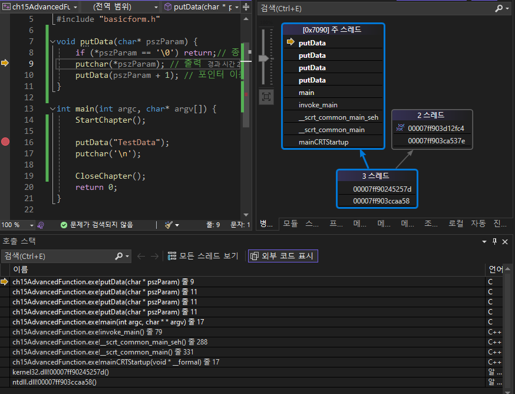

- 함수를 좀 더 깊게 보기
# I. 매개변수 전달기법
- C언어에서는 참조형을 포인터로 구현
	- Java는 class
- 인수, 매개변수, parameter, argument: 다 같은 말
- 매개변수는 Stack area에서 사용

Caller  Callee

## A. 매개변수
- 매개변수도 '변수'. 함수의 스코프 내부에 새 변수를 선언하고 값을 전달받아 초기화
```c
void TestFunc(int a) {
	int b = 20;
//	int a = 20; 이미 매개변수에서 호출함
	a = 10;
}
```
- 이처럼 함수에서 다시 인수를 선언하면 안됨
- 또한 굳이 값을 지정해서 초기화할 경우 굳이 인수로 받을 필요가 없음

## B. 매개변수의 전달
- 지역변수이자 자동변수인 매개변수가 저장되는 위치
	- 32bit: stack memory
	- 64bit: register(CPU)
- e위치x: 
	- e: register의 
	- 위치: 아래에서 c, d 
	- x: 16진수 표기 
  - 함수 외부(호출자)
	```dockerfile
		00007FF68C532268  mov         edx,0Ah (rdx에 10(16진수로 표기)) 
		00007FF68C53226D  mov         ecx,5	  (rcx에 5)
		00007FF68C532272  call        TestFunc (07FF68C5313DEh)  
	```
  - 함수 내부(피호출자)
	```dockerfile
	00007FF68C531D79  mov         dword ptr [a],0Ah  (함수 내부에서 처리될때는 지역변수. 포인터 표시)
	```

- 매개변수는 오른쪽 부터 입력됨: 기억해두면 유용

## C. 참조형
- Call by value 
	- 값
- Call by reference
	- 참조형(실체나 현상을 추상화해 개념으로 만들어 접근하도록 하게한 ..)
	- 접근하도록하는 것 : 참조자 : 주소 : pointer
	- C언어의 참조형은 메모리의 데이터 == 변수 
	- 변동, value 변경이 가능하므로 다른 객체지향언어들의 reference와는 다른점이 있음

### 1. Call by value
- 변수와 변수를 받아서 단순 연산을 처리하는 함수

```c
int Add(int a, int b) {
	int c = 0;
	c = a + b;
	return c;
}
int main(int argc, char* argv[]) {
	int a = 7;
	int res = 0;
	res = Add(3, 4);
	printf("%d\n", res);
	return 0;
```
- main() 시작

|fnc|data| identifier |
|---|---|-----------|
|||           |
|||           |
|||           |
|main|7| a         |

- disassembly code: 
00007FF7894822E8  mov         dword ptr [a],7  

	dword ptr : cpu에서 값을 가져올때 포인터로 접근

- 매개변수 전달(64bit이므로 register 사용)

|fnc|data|identifier|
|---|---|---|
||||
||||
||||
|main|7|a|
>	int res = 0;
00007FF7894822EF  mov         dword ptr [res],0  
	res = Add(3, 4);
00007FF7894822F6  mov         edx,4  
00007FF7894822FB  mov         ecx,3  
00007FF789482300  call        Add (07FF7894813E3h)
- Add(): 64bit프로세서에서는 register를 거쳐서 들어옴

|fnc|data|identifier|
|---|---|---|
|Add|0|c|
|Add|5|a|
|Add|10|b|
|main|7|a|
>disassembly code
	int c = 0;
00007FF7894817F2  mov         dword ptr [c],0  
	c = a + b;
00007FF7894817F9  mov         eax,dword ptr [b]  
00007FF7894817FF  mov         ecx,dword ptr [a]  

- 연산 : 중간연산 결과는 레지스터에서 관리

|fnc|data|identifier|
|---|---|---|
|Add|15|c|
|Add|5|a|
|Add|10|b|
|main|7|a|
- 연산 결과를 regist에서 변수 c에 저장
- 반환값을 전달할때 eax를 자주사용함
	- 직접 지정해서 사용하는 것이 아니므로 가능 

>disassembly code
00007FF789481805  add         ecx,eax  
00007FF789481807  mov         eax,ecx  
00007FF789481809  mov         dword ptr [c],eax  
	return c;
00007FF78948180C  mov         eax,dword ptr [c]  

- Add(): 64bit프로세서에서는 register를 거쳐서 나감

|fnc|data|identifier|
|---|---|---|
|main|15|res|
|main|7|a|

>disassembly code
	printf("%d\n", res);
00007FF789482308  mov         edx,dword ptr [res]  
00007FF78948230B  lea         rcx,[string "%d\n" (07FF78948AC10h)]  
00007FF789482312  call        printf (07FF78948119Fh)  

- main() 종료와 함께 해당 스레드 종료
>disassembly code: 
	return 0;
00007FF789482317  xor         eax,eax  
00007FF789482319  jmp         main+62h (07FF789482322h) 

### 2. Call by reference
- 포인터를 사용해 연결: 
	- main 함수의 메모리에 Add가 참조해서 사용하도록 함
	- call by value는 변수를 새로 생성해서 사용
- 함수의 매개변수를 포인터로 받음
	- 메모리 효율을 높이기 좋아 복잡하고 무거운 연산에서 사용 
```c
int Add(int* a, int* b) {
	return *a + *b;
}
```
- 호출자는 주소연산자를 사용해 전달
```c
int main(int argc, char* argv[]) {

	int x = 3, y = 4;
	printf("%d\n", Add(&x, &y));

	return 0;
}
```
- 디스어셈블리 이동 참고
```dockerfile
	int x = 3, y = 4;
00007FF725A84E61  mov         dword ptr [x],3  
00007FF725A84E68  mov         dword ptr [y],4  
	printf("%d\n", Add(&x, &y));
00007FF725A84E6F  lea         rdx,[y]  
00007FF725A84E73  lea         rcx,[x]  
00007FF725A84E77  call        Add (07FF725A813E3h)  
```
- 내부 함수
```dockerfile
int Add(int* a, int* b) {
00007FF725A817D0  mov         qword ptr [rsp+10h],rdx  
00007FF725A817D5  mov         qword ptr [rsp+8],rcx  
00007FF725A817DA  push        rbp  
00007FF725A817DB  push        rdi  
00007FF725A817DC  sub         rsp,0E8h  
00007FF725A817E3  lea         rbp,[rsp+20h]  
00007FF725A817E8  lea         rcx,[__CA2C9B2D_advancedFunction_basic@c (07FF725A92016h)]  
00007FF725A817EF  call        __CheckForDebuggerJustMyCode (07FF725A8137Ah)  
	return *a + *b;
00007FF725A817F4  mov         rax,qword ptr [a]  
00007FF725A817FB  mov         eax,dword ptr [rax]  
00007FF725A817FD  mov         rcx,qword ptr [b]  
00007FF725A81804  add         eax,dword ptr [rcx]  
}
```
- 값 반환
```dockerfile
00007FF725A84E7C  mov         edx,eax  
00007FF725A84E7E  lea         rcx,[string "%d\n" (07FF725A8AC10h)]  
00007FF725A84E85  call        printf (07FF725A8119Fh)  
```
## D. 실습
```dockerfile
두 char[]의 주소를 매개변수로 받아 문자열을 Deap copy하는 MyStrcpy() 작성
함수의 두번째 매개변수는 첫번째 매개변수의 메모리 크기가 되도록 구현
int main(int argc, char* argv[]) {
	char szBufferSrc[12] = { "TestString" };
	char szBufferDst[12] = { 0 };

	MyStrcpy(szBufferDst, sizeof(szBufferDst), szBufferSrc);
	puts(szBufferDst);
	return 0;
}
```
[실습 예제](../c_basic/ch15AdvancedFunction/AdvancedFunction_01Question.c)

- 여기서는 strlen(char*)를 쓰지 않아도 구현은 된다. 
```c
size_t nLenSrc = 0;
nLenSrc = strlen(targetArr);
```
- 하지만 대상 메모리 크기가 12바이트고 원본이 5바이트면 7바이트 만큼의 쓰레기 값이 복사된다
- 이 쓰레기 값은 오류를 발생시키므로 Deep copy는 맞으나 적절한 복사라 할 수 없다.
- 또한 원본의 크기가 타겟보다 더 큰경우 \0가 없기때문에 문제가 커질 수 있어 주의해야한다
```c
	char testSrc[7] = { "abcdef" };
	char targetDst[5] = { "1234"};
	MyStrcpy(targetDst, sizeof(targetDst), testSrc);
	puts(targetDst);
```
# II. 지역변수 주소 반환 오류
- 피호출 함수의 지역변수는 함수의 반환과 함께 모두 소멸
	- 지역변수가 속한 스택 프레임과 생명주기를 공유하기때문(자동변수)
	- malloc()을 사용한 경우는 free()로 할당을 없애지 않으면 참조 연결이 사라져도 남아있음
- 소멸된 메모리 영역의 주소를 호출자 함수에게 반환하고 접근하는 것은 매우 심각한 오류
	- return이 지역변수의 주소를 반환하는 함수
```c
int* TestFunc(void) {
	int nData = 10;
	return &nData;
}

int main(int argc, char* argv[]) {
	int* pnResult = NULL;
	pnResult = TestFunc();

	printf("%d\n", *pnResult);
	return 0;
}
```
- 값은 그대로 10이 나오긴함.
- stack 관찰
	- main()

	|fnc|data|identifier|
	|---|---|---|
	||||
	||||
	||||
	|main|주소|pnResult|

	- TestFunc()

	|fnc|data|identifier|
	|---|---|---|
	||||
	||||
	|TestFunc|10|nData|
	|main|주소|pnResult|

	- return 이후
	
	|fnc|data|identifier|
	|---|---|---|
	||||
	||||
	|(제거)|(제거)|(제거)|
	|main|&nData|pnResult|
> 여기서 출력된 값 10은 쓰레기 값의 형태
- 함수가 하나일때는 문제가 되지 않으나 혹시라도 메모리를 공유하는 경우 문제 발생
```c

int* TestFunc(void) {
	int nData = 10;
	return &nData;
}
int* TestFunc2(void) {
	int a = 5;
	return NULL;
}

int main(int argc, char* argv[]) {

	int* pnResult = NULL;
	pnResult = TestFunc();

	printf("TestFunc: %d\n", *pnResult);

	TestFunc2();
	printf("after TestFunc2: %d\n", *pnResult);

	return 0;
}
```
>console)
TestFunc: 10
after TestFunc2: 5

- return이 NULL이고 지역변수와 관계가 없음에도 이전의 사용했던 값이 쓰레기로 남아있어 이후에도 영향을 줌
	- 컴파일, 링크, 런 타입에서 예외가 발생하지 않음
	- 값이 이상해짐
- 절대로 주소를 반환하지 말것

# III. Call by reference와 메모리 동적 할당 이슈
## A. Swap하기
- call by reference에서 자주 사용되는 예제
```c
void Swap(int* pLeft, int* pRight) {
	int nTmp = *pLeft;
	*pLeft = *pRight;
	*pRight = nTmp;
}

int main(int argc, char* argv[]) {
	
	int x = 10, y = 20;
	printf("x=%d, y=%d\n", x, y);

	Swap(&x, &y);
	printf("x=%d, y=%d\n", x, y);
	
	return 0;
}
```
## B. 문자열 
- 메모리 동적 할당 및 해제와 함수
	- <b style="color:red">Pointer가 가진 근본적인 문제점</b> 
	- Callee가 메모리를 동적으로 할당한 후 반환하는 구조는 문제의 여지가 있음
		- Callee가 Caller에게 반환했을때 주소를 통해 접근
		- 이때 Callee가 메모리를 할당만 했을 경우(반환하지 않은 경우)
			- Caller가 해제를 해야하는데.. 이미 Collee는 사라진 상황
	- 메모리 해제에 대한 확실한 안내 필요
	- 할당된 메모리 크기 전달문제 고려
		- <b style="color:red">pointer만 봤을때 할당한 메모리 크기를 알 수 없다</b>
		- 할당한 메모리보다 앞/뒤를 사용하면 underflow/overflow가 발생
		- pointer는 size에 대한 상태를 전달하지 않는다
		=> 이슈 발생
- 문자열은 가변길이의 문자 배열임.
	- 이름을 받는 경우 매우 다양한 상황
		- 이름이 두 글자
			- 이이
		- 이름이 세 글자
			- 이순신 
		- 이름이 더 많은 글자
			- 남궁민수
		- 외국인인 경우
		...
	- 이 모든 경우의 수를 개발단계(compile 이전)에서 파악할 수 없다
- 정적으로 입력받으면 무조건 문제가 발생한다
	- 사용자 입력을 절대 신뢰하지 않는다
	- Fuzzing test(attack): 의도를 가지고 비정상적 입력을 수행
### 1. 정적으로 문자열을 입력 받기
 ```c
 void GetName(char* pszName, unsigned int nSize) {
	printf("이름을 입력하세요: ");
	gets_s(pszName, nSize);
}

int main(int argc, char* argv[]) {

	char szName[32] = { 0 };
	GetName(szName, sizeof(szName));
	printf("당신의 이름은 %s 입니다.\n", szName);

	return 0;
}
 ```
- gets_s를 통해 크기를 벗어난 데이터가 입력될 경우 비정상적 운용으로 인한 종료가 발생
- 다만 의도와 다름
### 2. 문자열을 동적으로 입력받기
```c
char* GetName(void) {
	char* pszName = NULL;
	pszName = (char*)calloc(32, sizeof(char));//동적할당
	printf("이름을 입력하세요: ");
	fgets(pszName, sizeof(char) * 32, stdin); //리눅스에서 사용
	// == gets_s()

	return pszName;
}

int main(int argc, char* argv[]) {
	char* pszName = NULL;
	pszName = GetName();
	//Callee에서 동적할당한 메모리 pszName은 stack frame 제거와 함께 사라짐
	printf("당신의 이름은 %s 입니다.\n", pszName);
	
	//Collee가 없으므로 할당 해제의 책임은 Caller
	free(pszName);

	return 0;
}
```
- 동적 할당과 해제가 분리되면... 문제 발생...
	- 특히 multi thread를 사용하는 경우 매우 심각
	- 이 경우 문서를 정말 자세히 작성해야함. 
	- 특히 메모리 할당 사이즈에 대해
- 해제 매커니즘에 대한 고민이 반드시 필요
	- Java는 메모리 해제를 JVM(Java Vitual Machine)의 GC(Garbage collector)가 수행
- GC를 직접 구현하는 경우가 많음
	- 동적 할당을 통해 참조 대상을 여러 참조자가 있는 경우
	- 모든 참조자가 사라진 경우 참조 대상에 접근할 방법이 사라짐
	- 참조 대상을 의존하고있는 참조자가 스택메모리에서 사라진 경우 참조 대상을 제거하는 기능
	- 한번쯤 구현해보면 실력 향상에 도움이 될 것임(rnwhcp )

# IV. 재귀 호출
- 함수 코드 내부에서 다시 자신을 호출하는 것
- Caller와 Callee가 같음
- 반복문과 Stack 자료구조를 합친 것
	- stack을 Call stack을 빌려 사용
	- 스택을 반복적으로 쓰는 이유? 돌아가려고.
	- 전체 대상을 순회/검색할때 자주 사용
		- quick sort
- 비선형 자료구조에서 매우 중요하게 활용
	- 특히 Tree 구조 
- 함수 호출 오버헤드는 감수
	- 메모리 관리
- 논리오류 발생시 Stack overflow 발생
## A. 대표적인 재귀호출 예제 - factorial
```c
int GetFactorial(int nParam) {
	int nResult = 0;
	if (nParam == 1) return 1;
	//Caller == Callee
	nResult = nParam * GetFactorial(nParam - 1);
	return nResult; 
}

int main(int argc, char* argv[]) {
	
	printf("5! = %d\n", GetFactorial(5));

	return 0;
}
```
- stack memory
	- TestFunc()

	|fnc|data|identifier|
	|---|---|---|
	||||
	||||
	||||
	|main|||

	|fnc|data|identifier|
	|---|---|---|
	||||
	||||
	|GetFactorial|5|nParam|
	|main|||

	|fnc|data|identifier|
	|---|---|---|
	||||
	|GetFactorial|0|nResult|
	|GetFactorial|5|nParam|
	|main|||
	- 재귀 1회

	|fnc|data|identifier|
	|---|---|---|
	|GetFactorial|0|nResult|
	|GetFactorial|4|nParam|
	|GetFactorial|0|nResult|
	|GetFactorial|5|nParam|
	|main|||

	- 재귀 2회

	|fnc|data|identifier|
	|---|---|---|
	|GetFactorial|0|nResult|
	|GetFactorial|3|nParam|
	|GetFactorial|0|nResult|
	|GetFactorial|4|nParam|
	|GetFactorial|0|nResult|
	|GetFactorial|5|nParam|
	|main|||

	- ... 반복

	|fnc|data|identifier|
	|---|---|---|
	|GetFactorial|1|nParam|
	|GetFactorial|0|nResult|
	|GetFactorial|2|nParam|
	|GetFactorial|0|nResult|
	|GetFactorial|3|nParam|
	|GetFactorial|0|nResult|
	|GetFactorial|4|nParam|
	|GetFactorial|0|nResult|
	|GetFactorial|5|nParam|
	|main|||

	- nParam = 1이므로 return 1

	|fnc|data|identifier|
	|---|---|---|
	|GetFactorial|1|nParam|
	|GetFactorial|1|nResult|
	|GetFactorial|2|nParam|
	|GetFactorial|0|nResult|
	|GetFactorial|3|nParam|
	|GetFactorial|0|nResult|
	|GetFactorial|4|nParam|
	|GetFactorial|0|nResult|
	|GetFactorial|5|nParam|
	|main|||

	|fnc|data|identifier|
	|---|---|---|
	|GetFactorial|1*2|nResult|
	|GetFactorial|3|nParam|
	|GetFactorial|0|nResult|
	|GetFactorial|4|nParam|
	|GetFactorial|0|nResult|
	|GetFactorial|5|nParam|
	|main|||

	|fnc|data|identifier|
	|---|---|---|
	|GetFactorial|3|nParam|
	|GetFactorial|1\*2*3|nResult|
	|GetFactorial|4|nParam|
	|GetFactorial|0|nResult|
	|GetFactorial|5|nParam|
	|main|||

	- ... 반복

	|fnc|data|identifier|
	|---|---|---|
	|GetFactorial|1\*2\*3\*4\*5|nResult|
	|GetFactorial|5|nParam|
	|main|||

	- main

	|fnc|data|identifier|
	|---|---|---|
	|main|1\*2\*3\*4\*5||

- 물론 고작 팩토리얼에 이정도 메모리 소모를 감수하지는 않는다. 
- 그저 학습용

## B. 문자열 출력 함수 만들기
```c
void putData(char* pszParam) {
	if (*pszParam == '\0') return;// 종료 문자 발견시 반복 멈춤
	putchar(*pszParam); // 출력
	putData(pszParam + 1); // 포인터 이동후 재귀 호출
}

int main(int argc, char* argv[]) {

	putData("TestData");
	putchar('\n');

	return 0;
}
```
>console)
TestData
- 호출 스택, 메모리, 병렬 메모리 확인 등

- 재귀호출하고 출력하면 문자열이 반대로 출력됨
```c
void putData(char* pszParam) {
	if (*pszParam == '\0') return;// 종료 문자 발견시 반복 멈춤
	putData(pszParam + 1); // 포인터 이동
	putchar(*pszParam); // 출력
}
```
>console)
ataDtseT


# V. 표준함수 잘쓰기
- 어떤 기능을 구현하기 전에...	
	- 공부 목적: 직접 만들어보기
	- 개발 : chatGPT에 해당 기능을 제공하는 함수가 있는지 먼저 물어보기


 


[실습 예제](../c_basic/ch15AdvancedFunction/.c)

[함수 응용 전체 코드](../c_basic/ch15ch15AdvancedFunction)