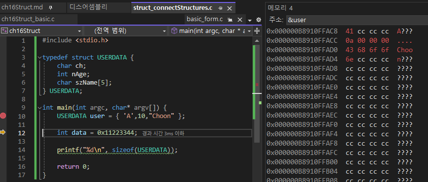
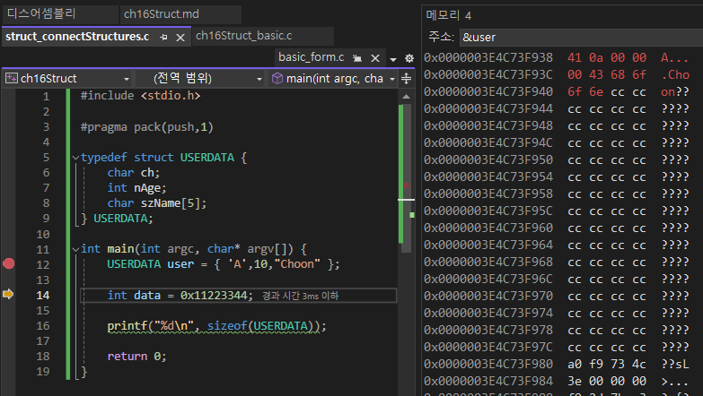

- 여러 자료형을 모아 새로운 하나의 형식으로 기술(선언)
	- ex: array, struct, union
	- 차이점
		
	|기준|배열|구조체|공용체|
	|---|---|---|--|
	|구분|index|member|member|
	|구성|같은 타입|여러 타입|여러 타입|
	|공간|가변|가변|고정|
	
- 정보를 관리하는 두가지 방식에 알맞은 두가지 방법 
	- NoSQL > Array
		- 나열
	- RDBMS > Struct
		- record와 column 
		- Map
- 공용체는 고정길이 공간을 정해놓고 그 내부를 유동적으로 사용(아래에서 다시)

# I. 구조체
- 구조체에 있는 요소에 이름을 둬서 구분: member
- 구조체 변수를 통해 개별 요소에 접근할 때는 멤버접근 연산자를 사용
	-  . : 변수에서 해당 구조체의 멤버로 들어감
	- -> : 동적 할당때는 ->를 사용
- 구조체 변수(or 인스턴스) 선언시 초깃값을 기술할 때는 반드시 멤버 선언 순서에 맞춰야함
- typedef 선언을 동반하는 것이 일반적
- java, C++의 class 시스템
## A. 선언
- 선언시 키워드: struct
```c
struct USERDATA
{
	int nAge; // member
	char szName[32];
	char szPhone[32];
}
```
- 호출 부: struct 구조체이름 구조체변수명 = {멤버,멤버,멤버...};
```c
int main(void)
{ //|-- 변수 타입 --|변수명| = {members...}
	struct USERDATA user	= {0,"",""}
}
```
- struct 키워드 생략하기: 호출 부에서 struct 제외하기
	- 구조체 선언부 앞뒤에 typedef와 구조체 변수명을 적으면 
```c
typedef struct USERDATA{
	int nAge;
	char szName[32];
	char szPhone[32];
}USERDATA
```
- 호출부에서 struct 키워드 없이 사용 가능
```c
int main(void)
{ //|변수 타입|변수명| = {members...}
	USERDATA	user  = {0,"",""}
}
```
## B. 인스턴스의 멤버 접근하기
- 구조체의 인스턴스 생성
```c
USERDATA	user  = {0,"",""}
//struct USERDATA user = {0,"",""};
```
- 해당 인스턴스의 멤버에 접근: 멤버접근 연산자
```c
	user.nAge = 10;
```
- 문자열은 깊은 복사
```c
strcpy_s(user.szName, sizeof(user.szName), "Hoon");
strcpy_s(user.szPhone, sizeof(user.szPhone), "010-1234-1234");
```
- 출력
```c
printf("user: \n이름: %s, 나이: %d, 연락처: %s\n",user.szName, user.nAge, user.szPhone);
```
# II. 구조체와 메모리 동적 할당
## A. 구조체 관리 
- 자료구조를 준비(설계) > 선언 
- 구조체도 배열 선언 가능
- malloc()으로 동적으로 선언해 관리하는 경우도 일반적
- 구조체에 대한 포인터 변수 선언시 멤버 접근 연산자가 달라짐
- 함수 반환형이나 매개변수 사용 가능
	- 이 부분은 포인터를 전달하는 것이 더 좋을 때가 많음 
## B. 동적 할당 예시
- 구조체의 포인터 변수 동적 할당
	- malloc()은  void*을 반환하므로 강제 형변환 연산을 해주는 것이 일반적 
	- sizeof(USERDATA)는 입력가능한 사이즈를 제공
		- structure member alignment(구조체 멤버 정렬)을 살펴봐야함
```c
	USERDATA* pUser = NULL;
	//구조체의 포인터 변수 동적 할당
	pUser = (USERDATA*)malloc(sizeof(USERDATA));
	
	pUser->nAge = 10;
	strcpy_s(pUser->szName, sizeof(pUser->szName), "hgeee");
	strcpy_s(pUser->szPhone, sizeof(pUser->szPhone), "010-1111-1222");

	printf("user: \n이름: %s, 나이: %d, 연락처: %s\n", 
		pUser->szName, pUser->nAge, pUser->szPhone);
	//할당 종료
	free(pUser);
```
## C. 구조체와 함수
### 1. 구조체를 반환하기?
- 물론 값을 직접 반환할 수 있다.
	- 여기서도 메모리 주소를 반환하는 것이 아님을 주의
```c
USERDATA GetUserDAta(void) {
	USERDATA user = { 0 };
	scanf_s("%d%*c", &user.nAge);
	gets_s(user.szName, sizeof(user.szName));
	gets_s(user.szPhone, sizeof(user.szPhone));

	return user;
}
```
- 하지만 그보다 구조체의 포인터를 받아서 직접 처리하는 것이 더 좋음
	- 가장 보편적 예시
```c
void GetUserData(USERDATA *pUser) {
	USERDATA user = { 0 };
	puts("회원정보를 입력합니다.\n나이: ");
	scanf_s("%d%*c", &user.nAge);
	puts("\n이름: ");
	gets_s(pUser->szName, sizeof(pUser->szName));
	puts("\n연락처: ");
	gets_s(pUser->szPhone, sizeof(pUser->szPhone));

	return;
}

int main(int argc, char* argv[]) {
	StartChapter(); 

	USERDATA user = { 0 };
	
	GetUserData(&user);

	printf("user: \n이름: %s, 나이: %d, 연락처: %s\n", 
		user.szName, user.szName, user.szPhone);

	CloseChapter();
	return 0;
}
```
### 2. 구조체를 매개변수로 사용하기
- 예시일뿐 이렇게 쓰는 경우는 없음
```c
USERDATA GetUserData(USERDATA userParam) {

	printf("user: \n이름: %s, 나이: %d, 연락처: %s\n",
		userParam.szName, 
		userParam.nAge, 
		userParam.szPhone);
	USERDATA user = { 
		10, "Hoon", "010-1111-2222"
	};
	return user;
}

int main(int argc, char* argv[]) {

	USERDATA user = {
		20, "Joon", "010-3333-4444"
	};
	USERDATA result;

	result = GetUserData(user);

	printf("result: \n이름: %s, 나이: %d, 연락처: %s\n", 
		result.szName, result.nAge, result.szPhone);
```
>console)
```
user:
이름: Joon, 나이: 20, 연락처: 010-3333-4444
result:
이름: Hoon, 나이: 10, 연락처: 010-1111-2222
```
>disassemble
- 호출부
```

	USERDATA user = {
00007FF7C84D1B72  mov         dword ptr [user],14h  
00007FF7C84D1B79  lea         rax,[rbp+14h]  
00007FF7C84D1B7D  lea         rcx,[string "Joon" (07FF7C84DAC10h)]  
00007FF7C84D1B84  mov         rdi,rax  
00007FF7C84D1B87  mov         rsi,rcx  
00007FF7C84D1B8A  mov         ecx,5  
00007FF7C84D1B8F  rep movs    byte ptr [rdi],byte ptr [rsi]  
00007FF7C84D1B91  lea         rax,[rbp+19h]  
00007FF7C84D1B95  mov         rdi,rax  
00007FF7C84D1B98  xor         eax,eax  
00007FF7C84D1B9A  mov         ecx,1Bh  
00007FF7C84D1B9F  rep stos    byte ptr [rdi]  
00007FF7C84D1BA1  lea         rax,[rbp+34h]  
00007FF7C84D1BA5  lea         rcx,[string "010-3333-4444" (07FF7C84DAC18h)]  
00007FF7C84D1BAC  mov         rdi,rax  
00007FF7C84D1BAF  mov         rsi,rcx  
00007FF7C84D1BB2  mov         ecx,0Eh  
00007FF7C84D1BB7  rep movs    byte ptr [rdi],byte ptr [rsi]  
00007FF7C84D1BB9  lea         rax,[rbp+42h]  
00007FF7C84D1BBD  mov         rdi,rax  
00007FF7C84D1BC0  xor         eax,eax  
00007FF7C84D1BC2  mov         ecx,12h  
00007FF7C84D1BC7  rep stos    byte ptr [rdi]  
		20, "Joon", "010-3333-4444"
	};
	USERDATA result;

	result = GetUserData(user);
00007FF7C84D1BC9  lea         rax,[rbp+210h]  
00007FF7C84D1BD0  lea         rcx,[user]  
00007FF7C84D1BD4  mov         rdi,rax  
00007FF7C84D1BD7  mov         rsi,rcx  
00007FF7C84D1BDA  mov         ecx,44h  
00007FF7C84D1BDF  rep movs    byte ptr [rdi],byte ptr [rsi]  
00007FF7C84D1BE1  lea         rdx,[rbp+210h]  
00007FF7C84D1BE8  lea         rcx,[rbp+1A8h]  
00007FF7C84D1BEF  call        GetUserData (07FF7C84D11DBh)  
```
- 함수 내부
```
	printf("user: \n이름: %s, 나이: %d, 연락처: %s\n",
00007FF7C84D1A4E  mov         rax,qword ptr [&userParam]  
00007FF7C84D1A55  add         rax,24h  
00007FF7C84D1A59  mov         rcx,qword ptr [&userParam]  
00007FF7C84D1A60  add         rcx,4  
00007FF7C84D1A64  mov         r9,rax  
00007FF7C84D1A67  mov         rax,qword ptr [&userParam]  
00007FF7C84D1A6E  mov         r8d,dword ptr [rax]  
00007FF7C84D1A71  mov         rdx,rcx  
00007FF7C84D1A74  lea         rcx,[string "user: \n\xc0\xcc\xb8\xa7: %s, \xb3\xaa\xc0\xcc: %d, \xbf\xac\xb6\xf4@"... (07FF7C84DADB8h)]  
00007FF7C84D1A7B  call        printf (07FF7C84D119Ah)  
		userParam.szName, 
		userParam.nAge, 
		userParam.szPhone);
	USERDATA user = { 
00007FF7C84D1A80  mov         rax,qword ptr [user]  
00007FF7C84D1A87  mov         dword ptr [rax],0Ah  
00007FF7C84D1A8D  mov         rax,qword ptr [user]  
00007FF7C84D1A94  lea         rcx,[string "Hoon" (07FF7C84DADE8h)]  
00007FF7C84D1A9B  lea         rdi,[rax+4]  
00007FF7C84D1A9F  mov         rsi,rcx  
00007FF7C84D1AA2  mov         ecx,5  
00007FF7C84D1AA7  rep movs    byte ptr [rdi],byte ptr [rsi]  
00007FF7C84D1AA9  mov         rax,qword ptr [user]  
00007FF7C84D1AB0  add         rax,9  
00007FF7C84D1AB4  mov         rdi,rax  
00007FF7C84D1AB7  xor         eax,eax  
00007FF7C84D1AB9  mov         ecx,1Bh  
00007FF7C84D1ABE  rep stos    byte ptr [rdi]  
00007FF7C84D1AC0  mov         rax,qword ptr [user]  
00007FF7C84D1AC7  lea         rcx,[string "010-1111-2222" (07FF7C84DADF0h)]  
00007FF7C84D1ACE  lea         rdi,[rax+24h]  
00007FF7C84D1AD2  mov         rsi,rcx  
00007FF7C84D1AD5  mov         ecx,0Eh  
00007FF7C84D1ADA  rep movs    byte ptr [rdi],byte ptr [rsi]  
00007FF7C84D1ADC  mov         rax,qword ptr [user]  
00007FF7C84D1AE3  add         rax,32h  
00007FF7C84D1AE7  mov         rdi,rax  
00007FF7C84D1AEA  xor         eax,eax  
00007FF7C84D1AEC  mov         ecx,12h  
00007FF7C84D1AF1  rep stos    byte ptr [rdi]  
		10, "Hoon", "010-1111-2222"
	};
	return user;
00007FF7C84D1AF3  mov         rax,qword ptr [user]  
}
```
- 다시 호출부
```
00007FF7C84D1BF4  lea         rcx,[result]  
00007FF7C84D1BFB  mov         rdi,rcx  
00007FF7C84D1BFE  mov         rsi,rax  
00007FF7C84D1C01  mov         ecx,44h  
00007FF7C84D1C06  rep movs    byte ptr [rdi],byte ptr [rsi]  

	printf("result: \n이름: %s, 나이: %d, 연락처: %s\n", 
00007FF7C84D1C08  lea         r9,[rbp+0A4h]  
00007FF7C84D1C0F  mov         r8d,dword ptr [result]  
00007FF7C84D1C16  lea         rdx,[rbp+84h]  
00007FF7C84D1C1D  lea         rcx,[string "result: \n\xc0\xcc\xb8\xa7: %s, \xb3\xaa\xc0\xcc: %d, \xbf\xac@"... (07FF7C84DAFC0h)]  
00007FF7C84D1C24  call        printf (07FF7C84D119Ah)  
		result.szName, result.nAge, result.szPhone);

	CloseChapter();
00007FF7C84D1C29  call        CloseChapter (07FF7C84D107Dh)  
	return 0;
00007FF7C84D1C2E  xor         eax,eax  
}
```
- 규모가 큰 구조체를 넘길때 값 자체를 넘기면 복사를 위한 메모리 소비가 매우 커진다.
- 이 역시 포인터로 처리하면 메모리 주소 이동만으로 처리할 수 있어 효율을 높힐수 있다. 
```c
void GetUserData(USERDATA *userParam) {
	USERDATA user = { 
		10, "Hoon", "010-1111-2222"
	};
	//memcpy(userParam, &user, sizeof(user));
	*userParam = user;
	//결과적으로는 같음
	//구조체는 개별 멤버 비교가 아닌 단순 대입은 가능(어차피 메모리 카피)
	return;
}

int main(int argc, char* argv[]) {
	StartChapter(); 

	USERDATA user = {
		20, "Joon", "010-3333-4444"
	};

	USERDATA result;
	GetUserData(&result);

	printf("result: \n이름: %s, 나이: %d, 연락처: %s\n", 
		result.szName, result.nAge, result.szPhone);

	CloseChapter();
	return 0;
}
```
- 반환값을 전달할 경우 동적할당을 사용.
	- 역시 반환 문제에 대해 고민 필수 

## D. 구조체를 멤버로 갖는 구조체
- 구조체 변수도 다른 구조체의 멤버가 될 수 있음
- 2번정도는 생각보다 흔함
- 컴파일러에게 선언을 알려야 하므로 기술 순서가 중요
- 자기 자신에 대한 포인터를 멤버로 갖는 구조체도 있음
	- 자기 참조 구조체
	- 연결 리스트(포인터를 노드로 참조...)
### 1. 선언
- 더 좁은 범위를 먼저 기술
```c
typedef struct MYBODY {
	int nHeight;
	int nWeight;
} MYBODY;

typedef struct USERDATA {
	int nAge;
	char szName[32];
	char szPhone[32];
	MYBODY bodySize;//여기서 사용
} USERDATA;
```
### 2. 초기화 
- 보통은 파일로 저장해서 불러옴
- 직접 기술은 보통 x
```c
	USERDATA user = {
		18,
		"Hone",
		"010-1234-1234",
		{176, 70}
	};
```
### 3. 멤버 접근
```c
	printf("이름: %s, 나이: %d, 연락처: %s\n h-w: %d - %d",
		user.szName,
		user.nAge,
		user.szPhone,
		user.bodySize.nHeight,
		user.bodySize.nWeight
	);
```
### 4. 자기참조 구조체
- 선언시에는 아직 typedef의 영향을 받지 않으므로 'struct 구조체명*'로 사용
```c
typedef struct USERDATA {
	int nAge;
	char szName[32];
	char szPhone[32];

	struct USERDATA* pFront;// pointer
	struct USERDATA* pNext;// pointer 
} USERDATA;
```
- 초기화때 노드를 담당하는 포인터는 일단 NULL
```c
	USERDATA user1 = {
		18,
		"Hone",
		"010-1111-1234",
		NULL
	};
	USERDATA user2 = {
		25,
		"Jone",
		"010-2222-1234",
		NULL
	};
	USERDATA user3 = {
		13,
		"Cone",
		"010-3333-1234",
		NULL
	};
```
- 노드에 순서를 부여하는 작업
	- 가장 중요
	- 일반적으로는 지역변수로 직접 삽입하지 않음
	- malloc을 사용해 동적 할당해서 사용
	- 가장 간단한 Linked list의 예시일뿐
	- 가장 앞과 뒤는 없으므로 NULL 또는 개발자가 생성할 script
```c
	user1.pNext = &user2;
	user2.pFront = &user1;
	user2.pNext = &user3;
	user3.pFront = &user2;
```
- 순환형이라면 처음과 마지막 노드에 연결
```c
	user1.pFront = &user3;
	...
	user3.pNext = &user1;
```
- 리스트를 연달아 사용하는 경우는 어떻게해야할까... 
```c
void GetUserList(USERDATA* user) {	
	printf("이름: %s, 나이: %d, 연락처: %s\n",
		user->szName,
		user->nAge,
		user->szPhone
	);
	if (user->pNext != NULL)
		GetUserList(user->pNext);
}
```

### 5. 실습예제
```dockerfile
간단한 연결리스트 예제(struct_simpleLinkedList.c)를 활용해 연결리스트 전체의 내용을 출력하는 함수 작성
제한사항
	함수의 매개변수로는 출력할 노드의 주소를 받음
	재귀호출을 통해 다음 노드로 이동하도록 구현
구조체
	typedef struct USERDATA {
		char szName[32];
		char szPhone[32];

		struct USERDATA* pFront;
		struct USERDATA* pNext;
	} USERDATA;
main
	USERDATA userList[4] = {
		{"김두식","1234",NULL},
		{"이미현","2345",NULL},
		{"김봉석","3456",NULL},
		{"장희수","4567",NULL},
	};
	userList[0].pNext = &userList[1];
	userList[1].pNext = &userList[2];
	userList[2].pNext = &userList[3];
	userList[3].pNext = NULL;
확인용 코드(실습에서는 제거)
	USERDATA* pUser;
	pUser = &userList[0];
	while (pUser != NULL) {
		printf("이름: %s, 연락처: %s\n",
			pUser->szName,
			pUser->szPhone
		);
		pUser = pUser->pNext;
	} 
```
[실습 코드](../c_basic/ch16Struct/struct_01Question.c)

- 반복문을 많이 쓰긴함


## E. 구조체 멤버 맞춤(구조체 사용시 중요한 부분)
- 구조체를 이루는 멤버의 메모리 공간은 관리 편의를 위해 완전히 연접하지 않고 일정 단위로 메모리를 구성
- 완전히 연접시킬 경우 전처리기를 이용해 설정 변경
> #pragma pack()

- 구조체 크기 예측하기
```c
typedef struct USERDATA {
	char ch; 
	int nAge;
	char szName[5];
} USERDATA;
```

- 예상: 10
	- char: 1byte
	- int: 4byte
	- char[5]: 5byte

```c
int main(int argc, char* argv[]) {
	USERDATA user = { 'A',10,"Choon" };
	
	int data = 0x11223344;// 변수 사이의 간격을 볼때 쓰는 데이터
	
	printf("%d\n", sizeof(USERDATA));

	return 0;
}
```
> console) 16

- 이런 느낌

<table>
	<thead>
		<tr>
			<th colspan="4">실제 메모리</th>
		</tr>
	</thead>
	<tbody style="text-align:center">
		<tr>
			<td style="background:azure;color:#000;font-weight: bolder;">ch</td>
			<td style="color:#fff;background:#000">x</td>
			<td style="color:#fff;background:#000">x</td>
			<td style="color:#fff;background:#000">x</td>
		</tr>
		<tr>
			<td colspan="4" style="background:azure;color:#000;font-weight: bolder;">nAge</td>
		</tr>
		<tr>
			<td colspan="4" style="background:azure;color:#000;font-weight: bolder;">szName[0~3]</td>
		</tr>
		<tr>
			<td style="background:azure;color:#000;font-weight: bolder;">[4]</td>
			<td style="color:#fff;background:#000">x</td>
			<td style="color:#fff;background:#000">x</td>
			<td style="color:#fff;background:#000">x</td>
		</tr>
	</tbody>
</table>



- 연접하는 방식 2가지
	- 프로젝트 설정하기 
		- c/c++ > code generation > 구조체 관련 설정(원하는 비트 수로 지정 가능)	
		- 구조체 멤버 맞춤을 변경하면 조절 가능 
		- but 좋은 방법아님
			- 공용설정은 건드는게 문제
			- 모든 프로젝트의 구조체가 영향을 받아 문제가 발생할 가능성이 매우 높음
	- 프로젝트 상단에 설정
		- 공백을 반드시 방지해야만하는 경우에 사용... 

```c

//push: 컴파일러에 기억시켜서 이 구조체는 1byte 단위로 설정하라는 의미
#pragma pack(push,1)
typedef struct USERDATA {
	char ch;
	int nAge;
	char szName[5];
} USERDATA;
```



# III. 비트필드
- 1byte(8bit) 정보를 쉽게 잘라 쓰기 위한 문법
	- 8bit: 전기 스위치 8개(on/off)
- 임베디드 시스템을 구현할때 사용(전기 신호를 다룰때 사용)
	- 그냥 이런게 있다 정도만
- 비트 mask > shift 방식을 대체
- 멤버는 비트 단위 데이터
	- unsigned char (top, right, left, main)
	- 제일 우측이 main
- 멤버 선언시 먼저 기술한 멤버는 8bits 중 오른쪽 부터 적용

```c
typedef struct _DATAFLAG {
	unsigned char main : 1;//bit 자리 수 0~1
	unsigned char left : 2;//0~3
	unsigned char right : 3;//0~7
	unsigned char top : 2;//0~3
} DATAFLAG;
```

| top |   | right |   |   | left |   | main |
|---|---|-------|---|---|------|---|------|
| 0 | 0 | 0     | 0 | 0 | 0    | 0 | 0    |


```c
	DATAFLAG flagSwitch = { 1,3,7,5 };
	
	printf("data: \n\tmain: %d\n\tleft: %d\n\tright: %d\n\ttop: %d\nflag: %X\nsize: %zd\n",
		flagSwitch.main,
		flagSwitch.left,
		flagSwitch.right,
		flagSwitch.top,
		*((unsigned char*)&flagSwitch),
		sizeof(flagSwitch)
	);
```
- top은 0~3인데  4가 입력된 상황(Over)

| t | t |r|r|r|l|l |m|
|---|---|--|--|--|--|--|--|
| ? | ? |1|1|1|1|1|0|

>console)
```
data:
        main: 0
        left: 3
        right: 7
        top: 0
flag: 3E
size: 1
```
- 결과 해석
	- m,l,r은 초기화 한대로
		- top: 4가 0이됨
	
			||t|t|r|r|r|l|l |m|
			|--|--|--|--|--|--|--|--|--|
			|<s style="color:red">1</s>|0|0|1|1|1|1|1|0| 
	
		- top에 5를 넣으면 1이 됨
			- overflow 발생: 범위를 넘어선 1은 사라지지만 그 이후 증가한 수는 그대로 입력되어
				
			||t|t|r|r|r|l|l |m|
			|--|--|--|--|--|--|--|--|--|
			|<s>1</s>|0|<span style="color:red">1</span>|1|1|1|1|1|0| 
 
			- top의 100은 1이제거된 00이되고, 101은 01만 남는다	
	- 16진수로 읽기: 0+0+2+1 + 8+4+2+1

		|bit|t|t|r|r|r|l|l |m|
		|--|--|--|--|--|--|--|--|--|
		|flag|0|0|1|1|1|1|1|0| 
		|자리|8|4|2|1|8|4|2|1|
	
	- size는 byte 단위이므로 1byte(8bit)

- shift를 사용한다면 &16진수로 원하는 자리를 잘라내서 사용
```c
	printf("main = flag & 0x01: %d\n", *((unsigned char*)&flagSwitch) & 0x01);
	printf("left = flag & 0x06 >> 1: %d\n", *((unsigned char*)&flagSwitch) & 0x06 >> 1);// 밀지 않으면 큰값(6)이 나옴
```


# IV. 공용체
- 한 대상에 대해 여러 해석방법(자료형)을 부여
- 32bit 정수에 대해 int, short[2], char[4]로 해석 가능
- 필요한 부분만 잘라쓸때 사용

<table>
	<thead>
		<tr style="background:#000;color:#fff;">
			<th>자료형</th>
			<th>byte</th>
			<th>bit</th>
			<th colspan=8>32bit 기준</th>
		</tr>
	</thead>
	<tbody>
		<tr>
			<td style="background:#000;color:#fff;">char[8]</td>			
			<td style="background:#000;color:#fff;">1</td>
			<td style="background:#000;color:#fff;">8</td>
			<td></td>
			<td></td>
			<td></td>
			<td></td>
			<td></td>
			<td></td>
			<td></td>
			<td></td>
		</tr>
		<tr>
			<td style="background:#000;color:#fff;">short[4]</td>
			<td style="background:#000;color:#fff;">2</td>
			<td style="background:#000;color:#fff;">16</td>
			<td colspan="2"></td>
			<td colspan="2"></td>
			<td colspan="2"></td>
			<td colspan="2"></td>
		</tr>
		<tr>	
			<td style="background:#000;color:#fff;">int[2]</td>
			<td style="background:#000;color:#fff;">4</td>
			<td style="background:#000;color:#fff;">32</td>
			<td colspan="4"></td>
			<td colspan="4"></td>
		</tr>
	</tbody>
</table>

- 중요한 이유: socket 연결을 위한 프로토콜(TCP/IP v4)에서 사용하는 단위가 32bit
	- IPv6도 있지만 아직도 v4 많이 사용되고 있음
	- 0~255(8bit) 4개
	- 자주 사용됨

## A. 선언
- struct와 마찬가지로 typedef를 사용
```c
typedef union _IP_ADDR {
	int nAddress;
	short awData[2];
	unsigned char addr[4];
} IP_ADDR;
```

## B. 필요에 따라 사용
- little endian: int로 삽입할때 값이 뒤집히는 모습을 보임

```c
	IP_ADDR Data = { 0 };
	Data.nAddress = 0x41424344;// ABCD
	
	printf("int nAddress\t: %X", Data.nAddress);
	putchar('\n');

	int it = sizeof(Data) / sizeof(char);
	printf("char addr\t: ");
	for(int i=0;i<it;i++)
		printf("%c", Data.addr[i]);
	putchar('\n');
	
	it = sizeof(Data) / sizeof(short);
	printf("short awData\t: ");
	for (int i = 0; i < it; i++)
		printf("%X", Data.awData[i]);
	putchar('\n');
```
>console)
```
int nAddress    : 41424344
char addr       : DCBA
short awData    : 43444142
```

- 메모리 점유 생각하기

<table>
	<thead>
		<tr>
			<th colspan=12>96bit(12byte)</th>
		</tr>		
		<tr style="background:#000">
			<th>1byte</th>
			<th>1byte</th>
			<th>1byte</th>
			<th>1byte</th>
			<th>1byte</th>
			<th>1byte</th>
			<th>1byte</th>
			<th>1byte</th>
			<th>1byte</th>
			<th>1byte</th>
			<th>1byte</th>
			<th>1byte</th>
		</tr>
	</thead>
	<tbody style="text-align: center">
		<tr>
			<td colspan="12" style="color:darkblue;background:aquamarine;">구조체</td>
		</tr>
		<tr>
			<td colspan="4">int</td>
			<td colspan="2">short</td>
			<td colspan="2">short</td>
			<td>ch</td>
			<td>ch</td>
			<td>ch</td>
			<td>ch</td>
		</tr>
		<tr>
			<td colspan="12" style="background: cornsilk;color:darkgoldenrod;">공용체</td>
		</tr>
		<tr>
			<td colspan="4">nAddress</td>
			<td colspan="8" style="background: #000; color: #fff">x</td>
		</tr>
		<tr>
			<td colspan="2">awData</td>
			<td colspan="2">awData</td>
			<td colspan="8" style="background: #000; color: #fff">x</td>
		</tr>
		<tr>
			<td>addr</td>
			<td>addr</td>
			<td>addr</td>
			<td>addr</td>
			<td colspan="8" style="background: #000; color: #fff">x</td>
		</tr>
	</tbody>
</table>


- IP주소 찍기
```c
	Data.addr[0] = 192;
	Data.addr[1] = 168;
	Data.addr[2] = 0;
	Data.addr[3] = 1;

	printf("address: %d.%d.%d.%d\n", 
		Data.addr[0],
		Data.addr[1],
		Data.addr[2],
		Data.addr[3]
	);
```

> 내 IP 찾기: ipconfig


[구조체 실습 코드](../c_basic/ch16Struct/.c)

[구조체 전체 코드](../c_basic/ch16Struct)