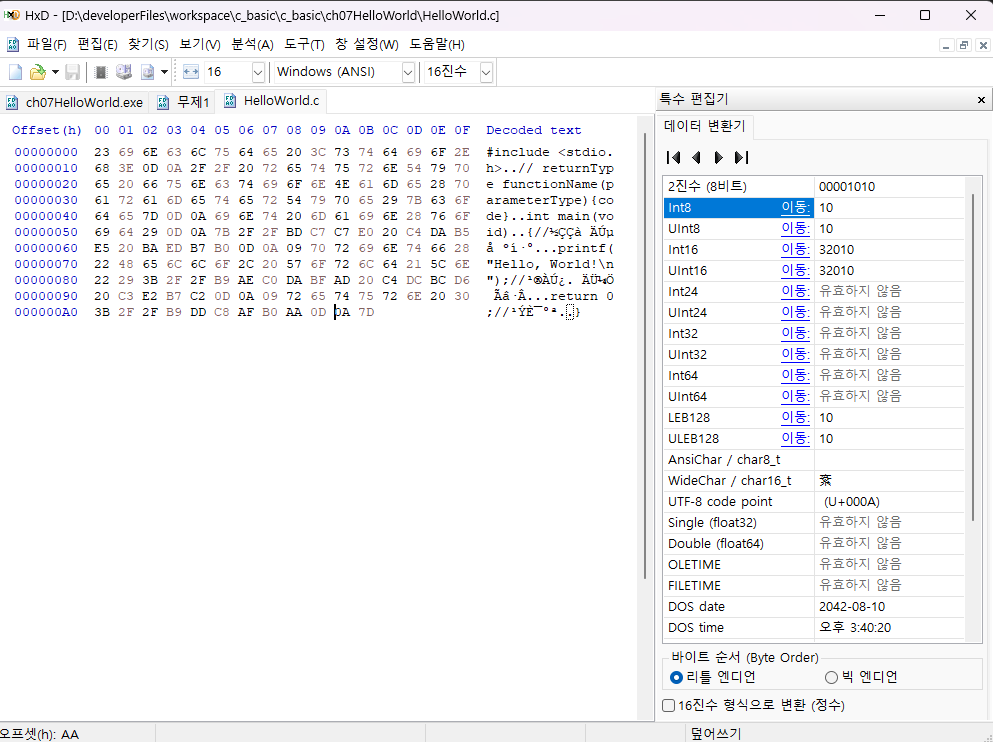

# I. 파일 시스템 기본 이론

- computer
	- CPU: 레지스터 등
	- RAM: 1차 메모리
	- SSD/HDD: 2차 메모리

||RAM|SSD<br/>HDD|
|---|---|---|
|메모리|1차 메모리|2차 메모리|
|지속성|휘발성|비휘발성|
|용량|소량(8GB~64GB)|대량(256GB~2TB)|
|대상|변수|파일|

- 파일 시스템 : 2차 메모리를 관리하는 방법
- 디지털 포렌식: client에서는 사용할 수 없는 데이터를 복구
	- 관련 지식 쌓기 좋은 사이트: [forensic-proof](http://forensic-proof.com/)


## A. 파일이란?
- 윈도우 파일 시스템(NTFS: New Technology File System)에서는 논리 드라이브 단위 및 경로로 사용
	- 드라이브의 논리적 분할(Partition)
		- Window programming 설치시 드라이브를 분할 할 수 있음
		- USB(Universal Serial Bus) Disk를 Bootable로 설정하고
		- 바이오스에서 드라이브를 지정
		- 분할 후 디스크를 포멧(사용 가능 상태로 변경 -> 기존 데이터 휘발 -> 포렌식으로 복구 가능)
		- 설치
- 물리적 디스크 
	- 볼륨(Disk)
		- 파티션(Partition)
- 절대경로(드라이브에서 시작)와 상대경로(현재 커서위치 시작)
	- Directory(Folder): 경로
		- 절대 경로(full path): 드라이브 기준에서 시작하는 전체 경로
		- 상대 경로: 현재 커서(directory 위치) 기준으로 파악
			- .  : 현재 디렉토리
			- .. : 상위 디렉토리
	- File: 보조기억 장치의 데이터 단위
		- 파일명+확장자

|| 경로|파일명.확장자|
|---|---|---|
|절대경로|C:\Data\A\ |Hello.c|
|상대경로 (현재경로)|./A/ |Hello.c|
|상대경로 (상위경로)|../Data/A/ |Hello.c|

- 경로는 전형적인 비선형 자료구조
 
## B. 프로세스
- 파일은 Data 단위. 
- 파일을 접근할 대상체(접근할 대상)이라고 한다면 접근의 주체는 Process
- 동시성 이슈: 여러 프로세스가 존재하는 시스템에서 한 파일에 대해 동시 접근하는 경우 데이터가 엉키는 문제가 발생할 수 있음
	- 두 프로세스가 한 파일에 접근할때
		- 데이터가 엉켜서 문제가 발생할 수 있음(파일 손상)
		- 운영체제(OS)가 프로세스의 접근을 통제
			- 접근 종류: R(read)W(write)X(execute) 
			- 각 접근에 대한 Open/Close를 관리
			- OS가 동시 접근을 허용할지 안할지를 결정
## C. 파일에 접근하는 방식

- 파일 입/출력에 사용되는 내부 버퍼가 있을 수 있음
	- Buffered Input/Output: 키보드 때 사용했던 것 
- 장치는 파일로 추상화(User mode Interface)
	- 대표적인 추상화된 것: Console(CMD) - 모니터, 키보드를 추상화 해놓은 유저 모드 인터페이스
	- 추상화: 현실의 대상/현상을 일반화, 단순화를 통해 개념화하는 과정
		- 데이터 파일 : 일반적인 데이터를 관리하는 파일
		- 장치 파일 : 장치를 추상화한 파일
- 하드웨어를 다룰때 발생하는 모습
```
[User mode]		탐색기		word		Excel
			File(추상화된 상태: User mode Interface)
---------------------------------------------내부

[Kernel mode]		File system	NET

			Filter(실시간 감지 엔진)


[SW]			Device Driver	
		
---------------------------------------------하드웨어
		
[HW]			SSD/HDD		NIC(LAN 카드)

```

## D. 요약
- 파일은 대상
- 접근 주체: 프로세스
- 행위: RWX
- 기본 접근: Open, Close(필수)
- 추상화: 장치, 데이터
- 스케쥴 관리: OS

## E. 파일 스트림(File Stream)
### 1. Stream의 특징
- 1차원 선형 구조
- 빈틈없이 연접하는 데이터

- 사용
	- 실시간 영상
	- 휘발적 흐름으로 이뤄진 상태
- 예시
	- bit stream: bit(0/1)의 흐름
### 2. 파일 스트림
- 비트 스트림으로 2차 메모리에 저장된 상태. 파일(단위)을 기준으로 사용됨
### 3. 1차, 2차 메모리 비교

||File|RAM|
|---|---|---|
|사용방식|File stream|malloc(c) - 가상메모리 동적 할당|
|크기 할당|0으로 선언해 write해 크기가 동적으로사용|선언시 사용할 메모리 크기를 지정|
|자료구조|1차원 선형구조|작성자|

### 4. 파일의 메모리 구조를 읽는 방법
- 1차 메모리의 구조는 디버거를 쓸 수 있으나 파일 스트림은 안됨
- [HxD 다운로드](https://mh-nexus.de/en/downloads.php?product=HxD20)

## F. 파일명, 확장명, 바이너리와 텍스트
- 윈도우 시스템에서 파일명은 파일 이름 + 확장명으로 구성
- 파일 형식은 바이너리와 텍스트(Binary+text = ASCII code)로 나누며
- 텍스트는 바이너리에 포함되는 것으로 볼 수 있음
- 텍스트 파일은 문자열로 해석할 수 있는 바이너리만 담긴 파일
	- 원래는 해석할 수 없는 키: -1
		- copy con으로 입력해서 파일입력이 종료될때 Ctrl+z가 입력됨
		- 이때 입력되는 값이 EOF(End Of File). 이 값이 -1
		- 입출력 buffer에 copy con으로 -1이 입력되면 입력 스트림이 종료됨
		- 물론 -1이라는 값을 쓰는 것과는 다름
- 1차 선형 구조로 전달된 bit stream을 해석해 버퍼에서 사용함
	- 사실상 버퍼도 하나의 스트림 

# II. 파일 생성, 개방, 폐쇄
# III. 텍스트 파일 입/출력
# IV. Buffered I/O와 파일 입출력 버퍼 플러싱
# V. 콘솔 I/O 버퍼 메모리 추적하기
# VI. 바이너리 파일 입/출력
# VII. 파일 입/출력 포인터 위치 제어


[파일 시스템 실습 코드](../c_basic/ch17FileSystem/.c)

[파일 시스템 전체 코드](../c_basic/ch17FileSystem)