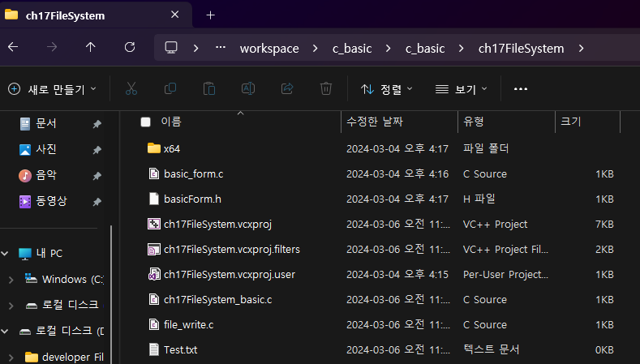
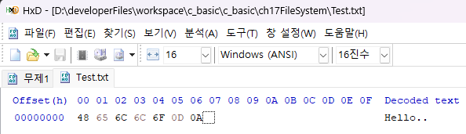
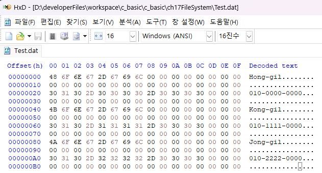
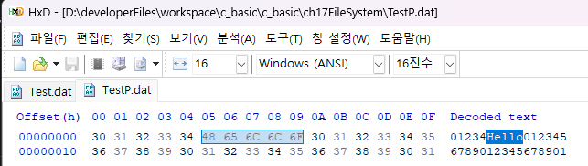

# I. 파일 시스템 기본 이론

- computer
	- CPU: 레지스터 등
	- RAM: 1차 메모리
	- SSD/HDD: 2차 메모리

||RAM|SSD<br/>HDD|
|---|---|---|
|메모리|1차 메모리|2차 메모리|
|지속성|휘발성|비휘발성|
|용량|소량(8GB~64GB)|대량(256GB~2TB)|
|대상|변수|파일|

- 파일 시스템 : 2차 메모리를 관리하는 방법
- 디지털 포렌식: client에서는 사용할 수 없는 데이터를 복구
	- 관련 지식 쌓기 좋은 사이트: [forensic-proof](http://forensic-proof.com/)


## A. 파일이란?
- 윈도우 파일 시스템(NTFS: New Technology File System)에서는 논리 드라이브 단위 및 경로로 사용
	- 드라이브의 논리적 분할(Partition)
		- Window programming 설치시 드라이브를 분할 할 수 있음
		- USB(Universal Serial Bus) Disk를 Bootable로 설정하고
		- 바이오스에서 드라이브를 지정
		- 분할 후 디스크를 포멧(사용 가능 상태로 변경 -> 기존 데이터 휘발 -> 포렌식으로 복구 가능)
		- 설치
- 물리적 디스크 
	- 볼륨(Disk)
		- 파티션(Partition)
- 절대경로(드라이브에서 시작)와 상대경로(현재 커서위치 시작)
	- Directory(Folder): 경로
		- 절대 경로(full path): 드라이브 기준에서 시작하는 전체 경로
		- 상대 경로: 현재 커서(directory 위치) 기준으로 파악
			- .  : 현재 디렉토리
			- .. : 상위 디렉토리
	- File: 보조기억 장치의 데이터 단위
		- 파일명+확장자

|| 경로|파일명.확장자|
|---|---|---|
|절대경로|C:\Data\A\ |Hello.c|
|상대경로 (현재경로)|./A/ |Hello.c|
|상대경로 (상위경로)|../Data/A/ |Hello.c|

- 경로는 전형적인 비선형 자료구조
 
## B. 프로세스
- 파일은 Data 단위. 
- 파일을 접근할 대상체(접근할 대상)이라고 한다면 접근의 주체는 Process
- 동시성 이슈: 여러 프로세스가 존재하는 시스템에서 한 파일에 대해 동시 접근하는 경우 데이터가 엉키는 문제가 발생할 수 있음
	- 두 프로세스가 한 파일에 접근할때
		- 데이터가 엉켜서 문제가 발생할 수 있음(파일 손상)
		- 운영체제(OS)가 프로세스의 접근을 통제
			- 접근 종류: R(read)W(write)X(execute) 
			- 각 접근에 대한 Open/Close를 관리
			- OS가 동시 접근을 허용할지 안할지를 결정
## C. 파일에 접근하는 방식

- 파일 입/출력에 사용되는 내부 버퍼가 있을 수 있음
	- Buffered Input/Output: 키보드 때 사용했던 것 
- 장치는 파일로 추상화(User mode Interface)
	- 대표적인 추상화된 것: Console(CMD) - 모니터, 키보드를 추상화 해놓은 유저 모드 인터페이스
	- 추상화: 현실의 대상/현상을 일반화, 단순화를 통해 개념화하는 과정
		- 데이터 파일 : 일반적인 데이터를 관리하는 파일
		- 장치 파일 : 장치를 추상화한 파일
- 하드웨어를 다룰때 발생하는 모습
```
[User mode]		탐색기		word		Excel
			File(추상화된 상태: User mode Interface)
---------------------------------------------내부

[Kernel mode]		File system	NET

			Filter(실시간 감지 엔진)


[SW]			Device Driver	
		
---------------------------------------------하드웨어
		
[HW]			SSD/HDD		NIC(LAN 카드)

```

## D. 요약
- 파일은 대상
- 접근 주체: 프로세스
- 행위: RWX
- 기본 접근: Open, Close(필수)
- 추상화: 장치, 데이터
- 스케쥴 관리: OS

## E. 파일 스트림(File Stream)
### 1. Stream의 특징
- 1차원 선형 구조
- 빈틈없이 연접하는 데이터

- 사용
	- 실시간 영상
	- 휘발적 흐름으로 이뤄진 상태
- 예시
	- bit stream: bit(0/1)의 흐름
### 2. 파일 스트림
- 비트 스트림으로 2차 메모리에 저장된 상태. 파일(단위)을 기준으로 사용됨
### 3. 1차, 2차 메모리 비교

||File|RAM|
|---|---|---|
|사용방식|File stream|malloc(c) - 가상메모리 동적 할당|
|크기 할당|0으로 선언해 write해 크기가 동적으로사용|선언시 사용할 메모리 크기를 지정|
|자료구조|1차원 선형구조|작성자|

### 4. 파일의 메모리 구조를 읽는 방법
- 1차 메모리의 구조는 디버거를 쓸 수 있으나 파일 스트림은 안됨
- [HxD 다운로드](https://mh-nexus.de/en/downloads.php?product=HxD20)

## F. 파일명, 확장명, 바이너리와 텍스트
- 윈도우 시스템에서 파일명은 파일 이름 + 확장명으로 구성
- 파일 형식은 바이너리와 텍스트(Binary+text = ASCII code)로 나누며
- 텍스트는 바이너리에 포함되는 것으로 볼 수 있음
- 텍스트 파일은 문자열로 해석할 수 있는 바이너리만 담긴 파일
	- 원래는 해석할 수 없는 키: -1
		- copy con으로 입력해서 파일입력이 종료될때 Ctrl+z가 입력됨
		- 이때 입력되는 값이 EOF(End Of File). 이 값이 -1
		- 입출력 buffer에 copy con으로 -1이 입력되면 입력 스트림이 종료됨
		- 물론 -1이라는 값을 쓰는 것과는 다름
- 1차 선형 구조로 전달된 bit stream을 해석해 버퍼에서 사용함
	- 사실상 버퍼도 하나의 스트림 

# II. 파일 생성, 개방, 폐쇄

- fopen()
	- fopen("파일명","접근모드 문자")
		- 해당 파일위치 포인터(메모리)를 반환
	- fopen_s("Path","파일명","접근모드 문자");
		- full path를 안쓰면 예제 .sln 파일이 있는 폴더가 현재 폴더로 사용되어 상대경로로 처리
		- 경로가 잘못되면 접근이 안됨
	- 보안 이슈로 fopen_s() 사용
	- 접근 모드 문자: read, write
		- write는 파일 스트림의 앞(덮어쓰기) = 기존 내용 비우고
		- append는 파일 스트림의 끝(이어쓰기) = 기존 내용 뒤에
		- execute는 x

|모드|의미|존재하는 경우|없는 경우|
|---|---|---|---|
|r|Text read|파일 열기|에러|
|w|Text write|기존 내용 지우고 열기|새로 생성|
|a|Text append|기존 내용 뒤에 추가|새로 생성|
|r+|Text read and update|파일 열기|에러|
|w+|Text write and update|기존 내용 지우고 열기|새로 생성|
|a+|Text append and update|기존 내용 뒤에 추가|새로 생성|
|rb|Binary read|파일 열기|에러|
|Wb|Binary write|기존 내용 지우고 열기|새로 생성|
|ab|Binary append|기존 내용 뒤에 추가|새로 생성|
|rb+|Binary read and update|파일 열기|에러|
|wb+|Binary write and update|기존 내용 지우고 열기|새로 생성|
|ab+|Binary append and update|기존 내용 뒤에 추가|새로 생성|

```c
	FILE* fp = NULL;

	fopen_s(&fp, "Test.txt", "w");
	if (fp == NULL) {
		puts("ERROR: Failed to open file!");
		return;
	}
	//TODO: File I/O

	//입출력 종료
	fclose(fp);
```
- fclose()로 종료하기 전까지는 다른 프로세스에서 사용 불가
- 파일만 생성되고 내용은 비어있음 

- 데이터 입력하기: fprintf(대상포인터, 형식문자열, 입력)
	- //TODO: File I/O 위치(fopen_s와 fclose 사이)에 문자열 쓰기
```c
//TODO: File I/O
	fprintf(fp, "%s\n", "Hello");
```
- HxD로 파일 데이터 보기
	- 입력한 문자열 + \r\n

- Enter 키 입력의 두가지
	- \r + \n: carriage return + line Feed
	- \n: line Feed
- 0D(\r) 0F(\n)를 알아두면 파일 입출력때 정신건강에 좋다.
	- 그만큼 읽기 쉽다 
	
<table>
	<tbody>
		<tr>
			<th>data</th>
			<td>48</td>
			<td>65</td>
			<td>6C</td>
			<td>6C</td>
			<td>6F</td>
			<td>0D</td>
			<td>0F</td>
		</tr>
		<tr>
			<th>문자</th>
			<td>H</td>
			<td>e</td>
			<td>l</td>
			<td>l</td>
			<td>o</td>
			<td>\r</td>
			<td>\n</td>
		</tr>
	</tbody>
</table>

- 다시 w로 호출하면 기존 파일내용이 사라지고 작성한 내용으로 적용
	- fopen_s(&fp, "Test.txt", "r+");은 덮어쓰기
	- fopen_s(&fp, "Test.txt", "a");는 뒤에 덧붙이기
- 가장 자주사용
	- 처음 생성시 w
	- 그 후 기존파일 재사용시 a
- _fcloseall(): fopen이 사용한 스트림을 모두 닫음
	- return : 스트림을닫은 횟수
	- 자주 사용되지는 않음

# III. 텍스트 파일 입/출력
- console I/O와 크게 다르진 않음
- 파일구조체에 대한 포인터만 추가
## A. character 사용
```c
	FILE* filePointer = NULL;
	char ch;
```
- 쓰기
```c
	fopen_s(&filePointer, "Test.txt", "w");
	fputs("Test string!!", filePointer);
	fclose(filePointer);
```
- 읽기
```c
	//파일 스트림 오픈
	fopen_s(&filePointer, "Test.txt", "r");
	if (filePointer == NULL)return;//값이 없을 때
	while ((ch = fgetc(filePointer)) != EOF) {//파일 스트림 종료(-1)까지 진행
		putchar(ch);//콘솔에 표시
	}
	//파일 스트림 닫기
	fclose(filePointer);
```
## B. 문자열(string) 사용
```c
	FILE* fp = NULL;
	char szBuffer[512] = { 0 };

	fopen_s(&fp, "Test.txt", "w");
	fputs("Test\n", fp);
	fputs("String\n", fp);
	fputs("Data\n",fp);
	fclose(fp);
	
	fopen_s(&fp, "Test.txt", "r");
	if (fp == NULL) return;
	
	// Console(HW)을 추상화시킨 CON(user mode file interface) 사용 
	while (fgets(szBuffer, sizeof(szBuffer), fp)) {
		printf("%s", szBuffer);
		memset(szBuffer, 0, sizeof(szBuffer));
	}
	printf("종료: %d", _fcloseall());
```
- Console(HW)을 추상화시킨 CON(user mode file interface)을 대상 파일로 사용하면 콘솔창이 나타남  
	 - puts와 실질적으로 차이가 없다.
```c
	fopen_s(&fp, "CON", "w");
	fputs("Hellow World and CON\n ", fp);
	fclose(fp);
```
- stdout도 같은 것
```c
	fputs("Hellow World and CON\n", fp);
	puts("Hellow World and CON");
	fputs("Hellow World and CON\n", stdout);
```
- 파일 구조체를 사용한다는 것 말고는 차이가 없다
```c

	FILE* fp = NULL;
	char szBuffer[512] = { 0 };
	int nData = 0;
	//fprintf
	fopen_s(&fp, "fscanfTest.txt", "w");
	fprintf(fp, "%d,%s\n", 20, "Test");	
	fclose(fp);

	//fscanf_s
	fopen_s(&fp, "fscanfTest.txt", "r");
	fscanf_s(fp, "%d,%s",
		&nData,
		szBuffer,
		(unsigned)_countof(szBuffer)
	);
	fclose(fp);
	
	printf("%d, %s", nData, szBuffer);
```

# IV. Buffered I/O와 파일 입출력 버퍼 플러싱
- 콘솔의 입력과 출력을 관리하는 사용자 파일 인터페이스
	- stdin, stdout
	- 각각 버퍼가 존재하고 그 버퍼를 운영체제가 표시
- buffering 버퍼링: 메모리 사용의 효율을 높이기 위해 버퍼가 기준 이상 사용될때까지 대기. 속도는 늦음
- flushing 플러싱: 대기상태인 스트림 모두 내보내기
```c
	FILE* fp = NULL;
	fopen_s(&fp, "CON", "r"); //stdin
//	fopen_s(&fp, "CON", "w"); //stdout

	char szBuffer[32] = { 0 };
	fgets(szBuffer, sizeof(szBuffer), fp);
	fputs(szBuffer, stdout);
	fflush(stdout);

	fclose(fp);
```
- fflush(): 입력에대한 플러싱
	- 버퍼 clear를 위해서 가끔 사용
		- fflush(fp);
	- 표준 입력(stdin)에는 굳이..
		- ffluch(stdin); 
- 직접 파일을 통해 장치(device/HDD, SSD...)에 직접관여하는 것이 아니다
	- OS에 위탁하면 OS가 스케쥴에 따라 처리, 조작
	- Buffered Input, Output
- 왜 굳이 버퍼를 사용할까?? 
	- 안정적으로 스트림을 조절해 사용자 안정성을 높이기 위함
	- live streaming때 여러 충격(기지국 변경, 일시적 이상 등)에 대응할 시간을 확보

# V. 콘솔 I/O 버퍼 메모리 추적하기
## A. FILE 구조체 살펴보기
- io buffer
```c
...
	typedef struct _iobuf
	{
		void* _placeholder;
	} FILE;
...
```
- visual studio의 버전이 올라가면서 직접 살펴볼수없게 됨
- reverse engineering
```c
typedef struct IOBUF_TEST
{
	char* pCur; // 현재 write된 위치
	char* pBase; // 스트림의 시작 지점
	int bufSize; // 스트림 크기
} IOBUF_TEST;
```
- window는 page 단위로 처리. 그 크기는 4KB(4096byte)
- 버퍼의 정보를 표시하는 함수
	- 메모리 위치를 기준으로 크기 연산
```c
void print_iobuf(IOBUF_TEST* pBuf) {
	printf("Base\t: %p\n",pBuf->pBase);
	printf("Current\t: %p\n", pBuf->pCur);
	printf("Buffer size\t: %d\n", pBuf->bufSize);
	printf("Written size\t: %zd\n\n",pBuf->pCur - pBuf->pBase);
}
```
- 버퍼 체크해보기
```c
	FILE* fp = NULL;

	// 디버거 사용을 위한 구조체 포인터 변수
	IOBUF_TEST* ioAddr = (IOBUF_TEST*)fp;

	fopen_s(&fp, "CON", "w");
	print_iobuf((IOBUF_TEST*)fp);

	fputs("Hello", fp);
	print_iobuf((IOBUF_TEST*)fp);

	fputs(" World", fp);
	print_iobuf((IOBUF_TEST*)fp);

	fclose(fp);
```
>console)
```
Base    : 0000000000000000
Current : 0000000000000000
Buffer size     : 0
Written size    : 0

Base    : 000001CC66F62890
Current : 000001CC66F62895
Buffer size     : 4091
Written size    : 5

Base    : 000001CC66F62890
Current : 000001CC66F6289B
Buffer size     : 4085
Written size    : 11

Hello World
```

# VI. 바이너리 파일 입/출력
- binary 모드임을 꼭 표기("wb")
	- fwrite(Buffer, ElementSize, ElementCount,FILE)
	- fwrite는 덮어쓰기
```c
typedef struct USERDATA {
	char szName[32];
	char szPhone[32];
} USERDATA;

int main(int argc, char* argv[]) {
	FILE* fp = NULL;
	USERDATA UserData = {"Hong-gil","010-0000-0000"};

	fopen_s(&fp, "TEst.dat", "wb");
	if (fp == NULL) return;
	//(Buffer, ElementSize, ElementCount,FILE)
	fwrite(&UserData, sizeof(USERDATA), 1, fp);

	fclose(fp);
```

- 구조체를 사용할때 64비트 단위로 잘라서 사용하면 편리
	- 다만 빈공간 낭비는 어쩔 수 없음
- 파일에서 데이터 읽어오기
	- fread(Buffer, size, count, fileStructPointer); 
```c
	memset(&UserData[0], 0, sizeof(UserData));
	fp = NULL;
	fopen_s(&fp, "Test.dat", "rb");
	if (fp == NULL) return;
	//fread(Buffer, size, count, fileStructPointer);
	int it = sizeof(UserData) / sizeof(USERDATA);

	for (int i = 0; i < it; i++) {
		puts("=====");
		fread(&UserData[i], sizeof(USERDATA), 1, fp);
		puts(UserData[i].szName);
		puts(UserData[i].szPhone);
	}

	fclose(fp);
```
- stream은 단방향 흐름이라 입력과 출력을 동시할 수 없음
>console)
```
=====
Hong-gil
010-0000-0000
=====
Kong-gil
010-1111-0000
=====
Jong-gil
010-2222-0000
```
- 주의!!
	- 문자열의 끝을 나타내는 0D 0F(\r\n)
	- 버퍼 크기가 32 인경우 문제가 발생
	- 입력은 신뢰하지말고 언제나 검증
		- 경계, 초과 데이터 등

# VII. 파일 입/출력 포인터 위치 제어
## A. 제어 설명
- FILE*를 말하는게 아님!!
	- 입출력이 발생하는 위치(index) 정보

<table style="text-align:center">
	<thead>
		<tr>
			<th colspan="10">File stream</th>
		</tr>
		<tr>
			<th>Base</th>
			<th></th>
			<th></th>
			<th></th>
			<th></th>
			<th>Cur</th>
			<th>
				<span style="color:red">p</span>
			</th>
			<th></th>
			<th></th>
			<th>End</th>
		</tr>
	</thead>
	<tbody>
		<tr>
			<td>H</td>
			<td>e</td>
			<td>l</td>
			<td>l</td>
			<td>o</td>
			<td>\0</td>
			<td></td>
			<td></td>
			<td></td>
			<td></td>
		</tr>
	</tbody>

</table>

- 이 위치를 조정할때 쓰는 함수: fseek
	-  binary mode에서만 작동: wb/rb/ab
	- fseek(filePointer, Offset-기준점에서 이동위치, Origin-기준점)
- fseek()를 위한 프리셋(in stdio.h)
```
#define SEEK_CUR    1 현위치
#define SEEK_END    2 끝점
#define SEEK_SET    0 시작점

#define FILENAME_MAX    260
#define FOPEN_MAX       20
#define _SYS_OPEN       20
#define TMP_MAX         _CRT_INT_MAX
#if __STDC_WANT_SECURE_LIB__
    #define TMP_MAX_S       TMP_MAX
    #define _TMP_MAX_S      TMP_MAX
#endif
```
- ftell(filePointer): base~current까지의 크기를 반환
```c
	FILE* fp = NULL;
	
	fopen_s(&fp, "Test.dat", "rb");

	fseek(fp, 0, SEEK_END);
	printf("size of Test.dat: %u\n", ftell(fp));

	fclose(fp);
```
>console)
```
size of Test.dat: 192
```
## B. 예제
```c
	FILE* fp = NULL;
	char* pszData = "01234567890123456789012345678901";//32byte

	fopen_s(&fp, "TestP.dat", "wb");
	if (fp == NULL) return;

	fwrite(pszData, 32, 1, fp);
	printf("current File pointer: %u\n", ftell(fp));

	fseek(fp, 5, SEEK_SET);//파일 포인터 이동
	printf("current File pointer: %u\n", ftell(fp));

	fwrite("Hello", 5, 1, fp);//현 위치부터 입력
	printf("current File pointer: %u\n", ftell(fp));

	fclose(fp);
```

>console)
```
current File pointer: 32
current File pointer: 5
current File pointer: 10
```

- 자주쓰이지는 않지만 필요할때 찾아 사용하면 됨

여기까지가 C언어의 기초
---
- 이후로는 약간 고급이론. 알아두면 좋은 것들


[파일 시스템 실습 코드](../c_basic/ch17FileSystem/.c)

[파일 시스템 전체 코드](../c_basic/ch17FileSystem)